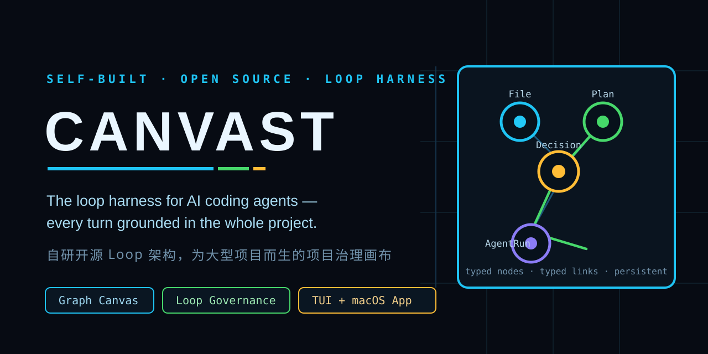
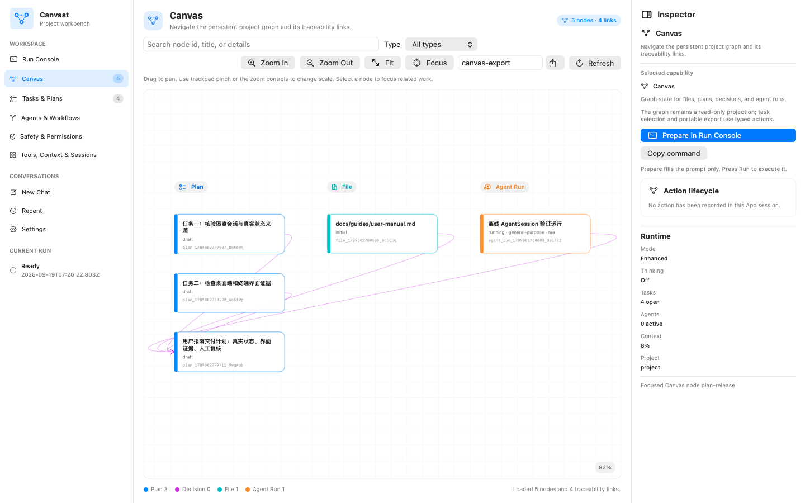
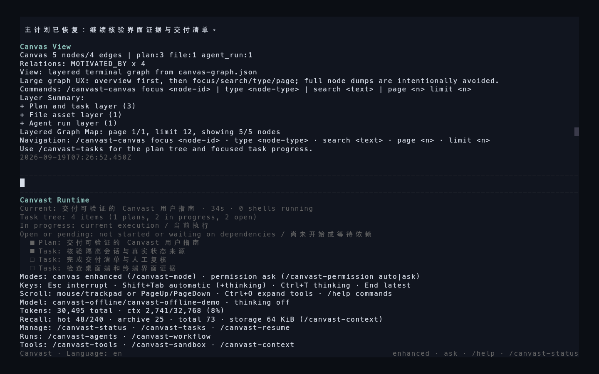
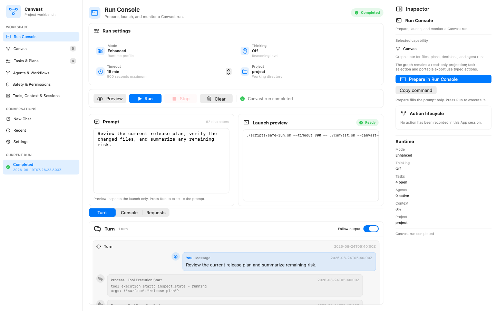
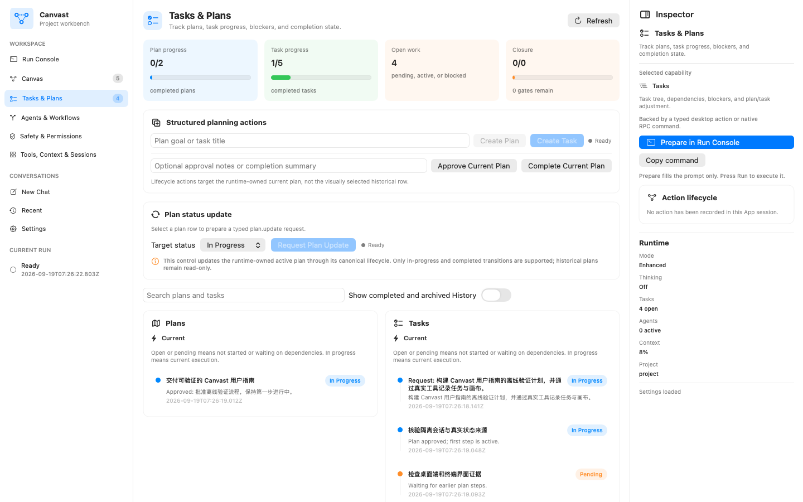
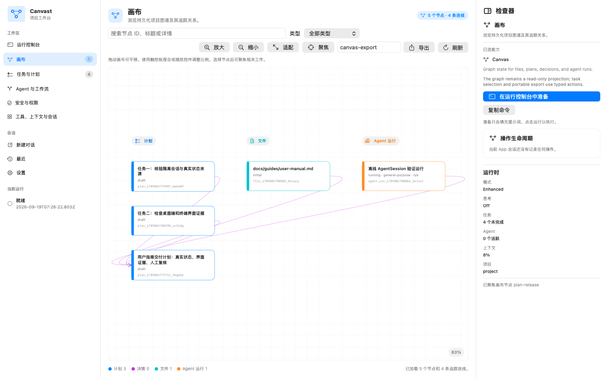
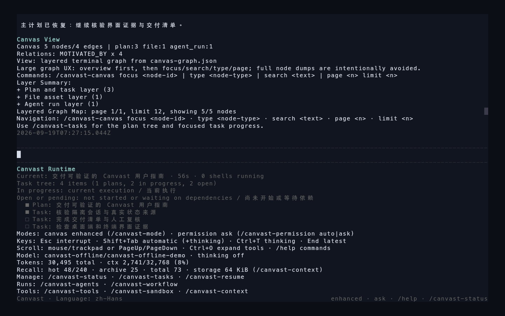
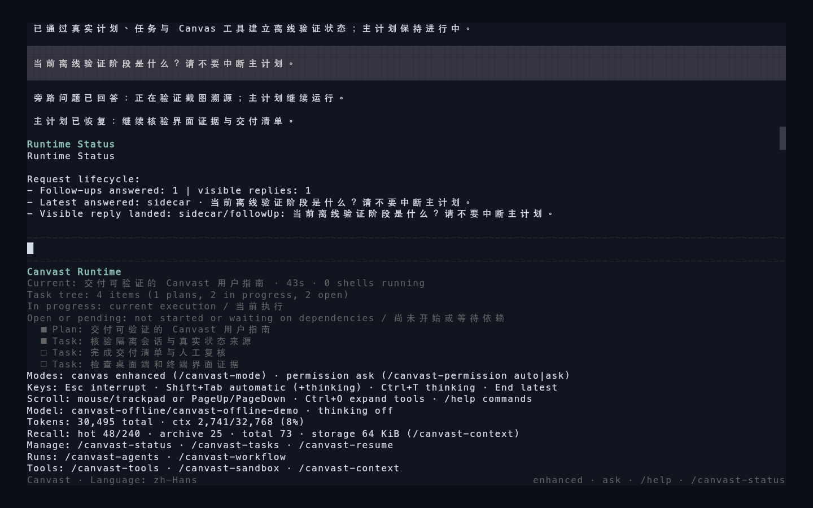
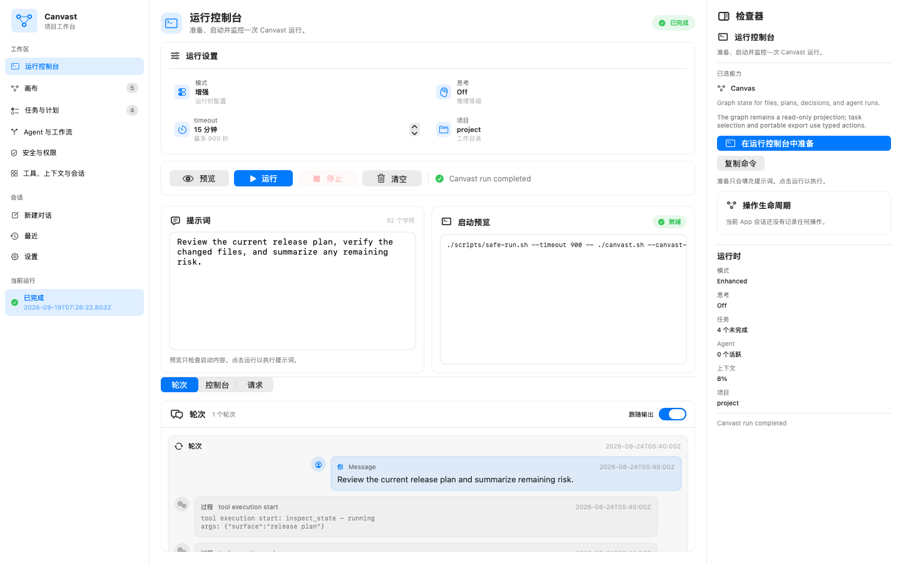
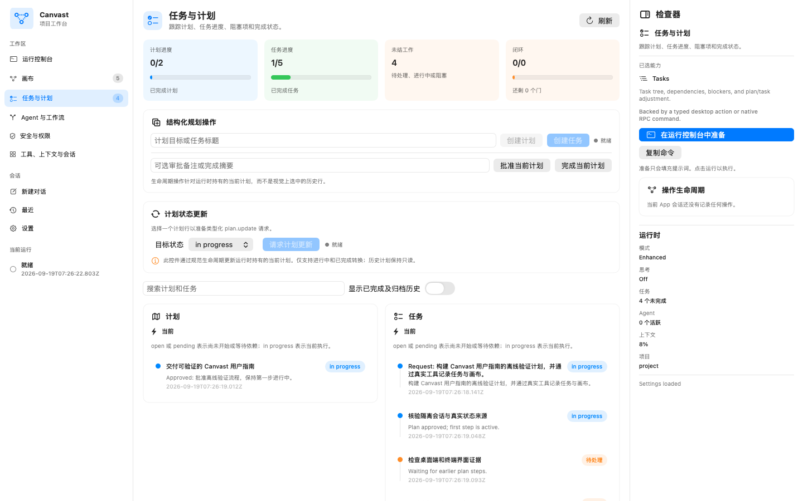

# Canvast

<p align="center">
  
</p>

<p align="center">
  <strong>A self-built, open-source loop harness for AI coding agents — built for large projects.</strong><br>
  自研开源的 Loop 架构 AI 编程 agent harness——为大型项目而生。
</p>

<p align="center">
  <a href="#english">English</a> ·
  <a href="#中文">中文</a> ·
  <a href="docs/guides/user-manual.md">User Manual</a> ·
  <a href="docs/EFFECTIVENESS_EVIDENCE.md">Effectiveness Evidence</a> ·
  <a href="https://github.com/cyberflax2020/canvast/releases">Releases</a>
</p>

## English

### What is Canvast

Canvast is a self-built, open-source (Apache-2.0) **loop harness** for AI coding agents: it wraps the agent's execution loop itself, and re-grounds every single turn in persistent, whole-project state. It runs on the open [pi](https://github.com/earendil-works/pi) runtime family as its engine, and adds the governance layer that large projects need: a persistent graph Canvas that acts as the project's living map, full-spectrum advanced harness capabilities, and a runtime whose every request, tool call, and approval stays visible.

One product, two surfaces: a fast terminal UI, and a native SwiftUI macOS App that opens the same persisted project state.

### Why existing harnesses lose the project

Traditional agent harnesses — including very good ones — share a structural weakness we kept hitting in real large-project work:

- **Every turn starts nearly blind.** The agent sees the conversation, not the project. A line of code exists because of an architectural decision made three weeks ago — but that relationship lives only in chat history.
- **Context compaction silently deletes the project.** As context keeps getting compressed, decisions, constraints, and rationales are silently dropped.
- **Forgetting.** Mid-task, the agent loses why it chose an approach, which files were already touched, and what was explicitly ruled out.
- **Goal drift.** Long tasks quietly lose their original objective; the plan on turn 80 is no longer the plan the user approved.
- **Fake completion.** Work gets declared "done" with no traceable evidence chain behind the claim.

Project complexity is networked; a conversation is linear. A harness that only manages the conversation will always lose the project.

### The answer: governance at every loop turn

Canvast treats the harness as a **loop architecture** problem, not a prompt problem:

- **Every loop turn is re-anchored.** Before each model turn, Canvast re-grounds the agent in persistent project state — the Canvas graph, the live plan tree, scoped task context, and runtime receipts — instead of relying on whatever survives in the conversation.
- **The project gets a living map.** The Graph Canvas records files, plans, decisions, and agent runs as a typed graph that persists across sessions and compactions. The agent navigates and updates the map; the map never depends on chat memory.
- **Work stays attributable.** Every artifact can be traced back to the plan and decision that produced it, so "done" means something checkable.

### Graph Canvas, illustrated

The Canvas is the signature capability of Canvast, and it is where large projects benefit most. Four typed node kinds — **File, Plan, Decision, AgentRun** — connected by typed links, queryable live by the agent, rendered live for you:



The same Canvas inside the terminal UI, alongside the sandbox safety state:



What this buys you in a large project:

- **Cross-session continuity that survives compaction** — project knowledge lives in the graph, not in the conversation.
- **Scoped context instead of ever-growing transcripts** — the agent reads the relevant slice of the graph for the task at hand.
- **Traceability** — any change can be walked back to its originating plan and decision.
- **Portability** — the persisted Canvas exports to JSON, Markdown, Mermaid, standalone SVG, and interactive HTML, from the CLI or natively from the App.

### A complete advanced harness toolkit

Everything you expect from a top-tier agent harness is here — and it is all governed by the same loop:

- **Context management**: context budgeting with bounded, scoped context instead of ever-growing transcripts; structured compaction that preserves the active plan, sub-agents, workflows, and tool-run state across the compact; token tracking; and governed long-term recall of project decisions.
- **Planning & tasks**: plan mode with enter / propose / approve / exit, a live plan-tree projection, and a full task lifecycle (`task_create`, `task_update`, `task_list`); automatic orchestration decisions are recorded as structured receipts.
- **Orchestration & delegation**: automatic DAG workflow decomposition (`run_workflow`); bounded sub-agent dispatch (`spawn_agent`, `parallel_agents`) with capacity limits and in-process or isolated execution; sidecar continuation for long-running primary work; and agent messaging (`send_message`, `list_agents`).
- **Execution**: sandboxed shell, file, and Git execution with identity pinning; background tasks; worktrees; and notebook editing.
- **Code intelligence**: LSP fallback lookup (definition, references, symbols, hover), a bounded structural repository map (`canvas_repomap`), and lightweight code review with structured findings.
- **Search & web**: bounded file and content search, and grounded web search / fetch / research with explicit evidence reasons.
- **Observability**: request receipts, input queue, request lifecycle, tool runs, runtime events, task and plan projections, approval history, and usage stats — first-class, inspectable state in both surfaces.
- **Safety and permissions**: `read-only`, `workspace-write`, and `full-access` profiles; typed grant and revoke actions with recorded rationale; credential redaction; a resource watchdog and a single process-fence wrapper (`safe-run.sh`) for heavy workloads; an owned-handle registry that pins PID, process group, and process birth time and fails closed on PID reuse.
- **Runtime hardening**: the relocatable sealed launcher scrubs dozens of inherited environment variables (including dynamic-linker injection and TLS key-logging hooks) and pins a known TLS configuration before starting the agent.
- **Extensibility**: explicitly activated skills (off by default, unknown names rejected), an MCP registry, cron schedules, monitors, and local HTML artifacts.

### Two surfaces, one project state

Steer a live run in the terminal with real-time status, live task and plan projection, and views like `/canvast-status`, `/canvast-tasks`, and `/canvast-canvas`:


Or open the same persisted project in the macOS App — Run Console, Tasks & Plans, Agents & Workflows, Safety & Permissions, Sessions, Canvas, and Settings:

<p align="center">
  
  
</p>

### Measured effectiveness

We hold ourselves to measured evidence. **Parity** — Canvast's full harness toolkit (orchestration, context management, planning, execution, observability, safety, extensibility) is benchmarked against Claude Code: same tasks, same protocol, same DeepSeek model backend on both sides. **Signature** — the Graph Canvas governance canvas is Canvast-specific and is probed separately. The block below is regenerated and verified by machine from the checked-in record — it says exactly what the record supports, and our own release gate rejects any comparative claim outside it.

<!-- CANVAST_EFFECTIVENESS_EN_START -->
Paired evaluation: Canvast vs the reference toolchain (2.1.233 (Claude Code); bare print via local compatibility proxy). Both sides ran against the same DeepSeek API model, deepseek-v4-flash.
- Task success: Canvast 12/12; reference 12/12; pass-rate difference 0.0 percentage points; 0 discordant pairs across 12 complete pairs (24 side-runs) with four crossover repeats and zero infrastructure exclusions.
- Median run latency: Canvast 27294 ms; reference 12780 ms; ratio 2.1357x. This overhead is disclosed as a known optimization target for upcoming releases.
- Model backend: both sides ran the same DeepSeek model, deepseek-v4-flash — confirmed by the Canvast project.

Beyond parity, Canvast's signature capability is the Graph Canvas governance canvas — a persistent File / Plan / Decision / AgentRun graph with typed links, BFS traceability, and canvas-scoped context. Claude Code offers no equivalent typed project graph.
- Machine-verified: Canvas projection and export worked in 2 of 4 measured repeats.
Full methodology and record: [Effectiveness Evidence](docs/EFFECTIVENESS_EVIDENCE.md).
<!-- CANVAST_EFFECTIVENESS_EN_END -->

### Get started

**Option 1 — Terminal (TUI).**

1. **Install Node.js and npm.** Canvast requires Node.js `22.19.0` or newer (npm ships with it). Install it from [nodejs.org](https://nodejs.org), then verify:

   ```bash
   node --version   # expect v22.19.0 or newer
   npm --version
   ```

2. **Configure `.env`.** The default provider is DeepSeek. Create a key at [platform.deepseek.com](https://platform.deepseek.com), then write a local `.env` file (one `KEY=value` per line — never commit it):

   ```text
   # required
   DEEPSEEK_API_KEY=your-deepseek-api-key

   # optional — pick a model and reasoning level
   CANVAST_MODEL=deepseek-v4-pro
   CANVAST_THINKING=high

   # optional — switch provider (each provider needs its own key)
   # CANVAST_PROVIDER=anthropic
   # ANTHROPIC_API_KEY=your-anthropic-api-key
   # CANVAST_MODEL=claude-sonnet-5
   ```

   Supported keys: `DEEPSEEK_API_KEY`, `ANTHROPIC_API_KEY`, `CANVAST_PROVIDER`, `CANVAST_MODEL`, `CANVAST_THINKING`, `CANVAST_SUBAGENT_MODEL` (see [Configuration](docs/guides/configuration.md)).

3. **Run Canvast.** From a repository checkout, or after extracting `canvast-tui-0.1.0.tgz` from [Releases](https://github.com/cyberflax2020/canvast/releases):

   ```bash
   npm ci          # use npm install inside an extracted package
   ./canvast.sh
   ```

Then ask for the first outcome you want:

```bash
./canvast.sh -p "Summarize the current project state."
```

**Option 2 — macOS App.** Requirements: macOS 13 or newer. Download `Canvast-macos-0.1.0.zip` from [Releases](https://github.com/cyberflax2020/canvast/releases), extract it, and move `Canvast.app` to Applications. The App embeds the sealed runtime — no separate Node.js install is required. The build is ad-hoc signed, so on first launch use right-click → Open; paste your DeepSeek key into Settings → API Key, pick a project, and continue in the Run Console.

Export the Canvas at any time:

```bash
npm run export:canvas -- --out ./canvas-export --title "Project Canvas"
```

### Documentation

| Topic | Document |
|---|---|
| Full guide | [User Manual](docs/guides/user-manual.md) · [中文指南](README.zh-CN.md) |
| Setup | [Configuration](docs/guides/configuration.md) |
| Verification model | [Verification and Evidence](docs/guides/testing.md) |
| Measured results | [Effectiveness Evidence](docs/EFFECTIVENESS_EVIDENCE.md) |
| Architecture | [Overview](docs/architecture/overview.md) · [Canvas and Traceability](docs/architecture/canvas-and-traceability.md) · [Runtime Orchestration](docs/architecture/runtime-orchestration.md) |
| Open-source base | [Open-Source Adoption Record](docs/architecture/open-source-adoption-record.md) |
| Network boundary | [External Services](docs/reference/external-services.md) |
| Contributing | [CONTRIBUTING.md](CONTRIBUTING.md) |
| Security | [SECURITY.md](SECURITY.md) |

### License

[Apache-2.0](LICENSE) — open source, commercially usable. Third-party components and their licenses: [THIRD_PARTY_NOTICES.md](THIRD_PARTY_NOTICES.md).

## 中文

### Canvast 是什么

Canvast 是一个自研、开源（Apache-2.0）的 **loop 架构 AI 编程 agent harness**：它钩住 agent 的执行循环本身，让每一轮都重新锚定到持久化的全项目状态上。它以开放的 pi 运行时为引擎，加上大型项目所需的治理层：作为项目活地图的持久化图谱 Canvas、全量高级 harness 能力，以及一个每个请求、每次工具调用、每条审批都可见的运行时。

一个产品，两个界面：快速终端 TUI，以及把同一份持久化项目状态打开为完整工作空间的原生 SwiftUI macOS App。

### 为什么现有 harness 会丢失项目

传统 agent harness——包括非常优秀的那些——都有一个结构性弱点，我们在真实的大型项目工作中反复撞到：

- **每一轮几乎都是半盲启动。** agent 看到的是对话，不是项目。某一行代码之所以这么写，是因为三周前的一个架构决策——但这种关系只存在于对话历史里。
- **上下文压缩会静默删除项目。** 随着上下文不断被压缩，决策、约束和理由被静默丢弃。
- **遗忘。** 任务做到一半，agent 忘了当初为什么选这个方案、哪些文件已经动过、什么被明确排除过。
- **目标漂移。** 长任务做着做着丢了原始目标；第 80 轮的计划已经不是用户批准的那个计划。
- **假完成。** 没有可追溯的证据链，就宣布"完成了"。

项目复杂度是网状的，而对话是线性的。只管对话的 harness，注定会丢失项目。

### 解法：在每一轮 loop 上做治理

Canvast 把 harness 当作 **loop 架构**问题来解决，而不是提示词问题：

- **每一轮都重新锚定。** 在每个模型轮次之前，Canvast 用持久化项目状态重新锚定 agent——Canvas 图谱、实时计划树、作用域任务上下文和运行时回执——而不是依赖对话里碰巧剩下的内容。
- **项目有一张活地图。** Graph Canvas 把文件、计划、决策和 agent 运行记录为 typed graph，跨 session、跨压缩持久存在。agent 在地图上导航和更新；地图从不依赖对话记忆。
- **工作始终可归因。** 任何产物都可以回溯到产生它的计划和决策，"完成"因此是可检查的。

### Graph Canvas：治理画布图解

Canvas 是 Canvast 的标志性能力，也是大型项目受益最多的地方。四种类型节点——**File、Plan、Decision、AgentRun**——由 typed link 连接，agent 可实时查询，你也能实时看到：



终端 TUI 里的同一张 Canvas，旁边是沙箱安全状态：



在大型项目里，这意味着：

- **跨 session、跨压缩的连续性**——项目知识长在图谱里，不在对话里。
- **有界上下文，而不是无限增长的 transcript**——agent 只读取与当前任务相关的图谱切片。
- **可溯源**——任何改动都能走回产生它的计划与决策。
- **可移植**——持久化 Canvas 可导出为 JSON、Markdown、Mermaid、独立 SVG 和交互式 HTML,CLI 与 App 原生路径均可。

### 全量高级 harness 能力

你对顶级 agent harness 的一切期待都在这里——并且都被同一条 loop 治理：

- **上下文管理**：有界的 scoped 上下文，而不是无限增长的 transcript；结构化压缩在压缩后保留活动计划、子 agent、workflow 与工具运行状态；token 追踪；受治理的项目决策长期召回。
- **计划与任务**：plan mode（进入/提出/批准/退出）、实时计划树投影、完整任务生命周期（`task_create`、`task_update`、`task_list`）；自动编排决策记录为结构化回执。
- **编排与委派**：自动 DAG workflow 拆分（`run_workflow`）；有界子 agent 配发（`spawn_agent`、`parallel_agents`，容量受限，进程内或隔离执行）；长跑主任务的 sidecar 接续；agent 消息传递（`send_message`、`list_agents`）。
- **执行**：带身份钉住的沙箱 shell、文件与 Git 执行；后台任务；worktree;notebook 编辑。
- **代码智能**：LSP fallback 查询（定义、引用、符号、hover）、有界的结构化仓库图谱（`canvas_repomap`）、轻量代码评审与结构化 findings。
- **搜索与联网**：有界的文件与内容搜索；带显式证据理由的联网搜索/抓取/研究。
- **观测**:request receipt、input queue、request lifecycle、tool runs、runtime events、task 与 plan 投影、approval history、usage stats——两个界面上都是一等可检查状态。
- **安全与权限**:`read-only`、`workspace-write`、`full-access` 三档 profile；带记录理由的 typed grant 与 revoke；凭据脱敏；面向重负载的资源 watchdog 与进程围栏（`safe-run.sh`)；钉住 PID、进程组与进程出生时间、PID 复用时安全拒绝的 owned-handle 注册表。
- **运行时加固**：可迁移密封启动器在启动 agent 前清除数十个继承环境变量（包括动态链接器注入与 TLS key-logging 钩子），并钉住已知 TLS 配置。
- **可扩展**：显式启用的 skill（默认关闭，未知名称拒绝）、MCP registry、cron 调度、监控器、本地 HTML artifact。

### 两个界面，同一份项目状态

在终端里引导活跃运行：实时状态、实时任务与计划投影，以及 `/canvast-status`、`/canvast-tasks`、`/canvast-canvas` 等视图：



或者在 macOS App 里打开同一个持久化项目——Run Console、Tasks & Plans、Agents & Workflows、Safety & Permissions、Sessions、Canvas 和 Settings:

<p align="center">
  
  
</p>

### 实测有效性

我们只用实测证据说话：以 Claude Code 为参考工具链做配对运行——同任务、同协议、两侧相同的 DeepSeek 模型后端。常规 harness 能力的目标是与参考持平；Canvast 的特色能力单独探针测量。下方区块由机器从已检入记录重新生成并校验——记录支持什么，它就说什么；任何区块之外的对比声明都会被我们自己的发布门禁拒绝。

<!-- CANVAST_EFFECTIVENESS_ZH_START -->
配对评估：Canvast 对比参考工具链（2.1.233 (Claude Code)；bare print via local compatibility proxy）。两侧运行相同的 DeepSeek API 模型 deepseek-v4-flash。
- 任务成功率：Canvast 12/12；参考运行 12/12；通过率差值 0.0 个百分点；共 12 个完整配对（24 次单侧运行），四轮交叉重复、基础设施排除数为零，结果不一致的配对 0 个。
- 中位运行时长：Canvast 27294 毫秒；参考运行 12780 毫秒；比值 2.1357x。该开销已公开记录为后续版本的优化目标。
- 模型后端：两侧运行同一 DeepSeek 模型 deepseek-v4-flash，由 Canvast 项目确认。

对标之外，Canvast 的标志性特色是 Graph Canvas 治理画布——File / Plan / Decision / AgentRun 持久化图谱，带 typed link、BFS 可回溯与 Canvas 作用域上下文。Claude Code 没有对应的 typed 项目图谱。
- 机器验证：Canvas 投影与导出在 4 次重复中 2 次通过。
完整方法论与记录见：[有效性证据](docs/EFFECTIVENESS_EVIDENCE.md)。
<!-- CANVAST_EFFECTIVENESS_ZH_END -->

### 快速开始

**方式一：终端（TUI)。**

1. **安装 Node.js 与 npm。** Canvast 需要 Node.js `22.19.0` 或更高版本（npm 随 Node.js 一并安装）。请从 [nodejs.org](https://nodejs.org) 安装，然后验证：

   ```bash
   node --version   # 应为 v22.19.0 或更高
   npm --version
   ```

2. **配置 `.env`。** 默认 provider 为 DeepSeek，请在 [platform.deepseek.com](https://platform.deepseek.com) 创建 key，然后写入本地 `.env` 文件（每行一条 `KEY=value`，切勿提交进版本库）：

   ```text
   # 必填
   DEEPSEEK_API_KEY=你的-deepseek-api-key

   # 可选——选择模型与推理强度
   CANVAST_MODEL=deepseek-v4-pro
   CANVAST_THINKING=high

   # 可选——切换 provider（每个 provider 需要自己的 key）
   # CANVAST_PROVIDER=anthropic
   # ANTHROPIC_API_KEY=你的-anthropic-api-key
   # CANVAST_MODEL=claude-sonnet-5
   ```

   支持的变量：`DEEPSEEK_API_KEY`、`ANTHROPIC_API_KEY`、`CANVAST_PROVIDER`、`CANVAST_MODEL`、`CANVAST_THINKING`、`CANVAST_SUBAGENT_MODEL`（见 [配置指南](docs/guides/configuration.md)）。

3. **运行 Canvast。** 仓库 checkout，或从 [Releases](https://github.com/cyberflax2020/canvast/releases) 解压 `canvast-tui-0.1.0.tgz` 后：

   ```bash
   npm ci          # 解压后的 package 内使用 npm install
   ./canvast.sh
   ```

然后直接请求你要的第一个结果：

```bash
./canvast.sh -p "Summarize the current project state."
```

**方式二：macOS App。** 环境要求：macOS 13 或更高版本。从 [Releases](https://github.com/cyberflax2020/canvast/releases) 下载 `Canvast-macos-0.1.0.zip`，解压后将 `Canvast.app` 移入"应用程序"。App 内嵌密封运行时，无需单独安装 Node.js。构建为 ad-hoc 签名，首次启动请右键 → 打开；在 Settings → API Key 中粘贴你的 DeepSeek key，选择项目，即可在 Run Console 中继续工作。

随时导出 Canvas:

```bash
npm run export:canvas -- --out ./canvas-export --title "Project Canvas"
```

### 文档导航

| 主题 | 文档 |
|---|---|
| 完整指南 | [用户手册](docs/guides/user-manual.md) · [中文指南](README.zh-CN.md) |
| 安装配置 | [配置指南](docs/guides/configuration.md) |
| 验证模型 | [验证与证据](docs/guides/testing.md) |
| 实测结果 | [有效性证据](docs/EFFECTIVENESS_EVIDENCE.md) |
| 架构 | [总览](docs/architecture/overview.md) · [Canvas 与溯源](docs/architecture/canvas-and-traceability.md) · [运行时编排](docs/architecture/runtime-orchestration.md) |
| 开源基础 | [开源采用记录](docs/architecture/open-source-adoption-record.md) |
| 网络边界 | [外部服务边界](docs/reference/external-services.md) |
| 参与贡献 | [CONTRIBUTING.md](CONTRIBUTING.md) |
| 安全 | [SECURITY.md](SECURITY.md) |

### 许可证

[Apache-2.0](LICENSE)——开源，可商用。第三方组件及其许可证见 [THIRD_PARTY_NOTICES.md](THIRD_PARTY_NOTICES.md)。
