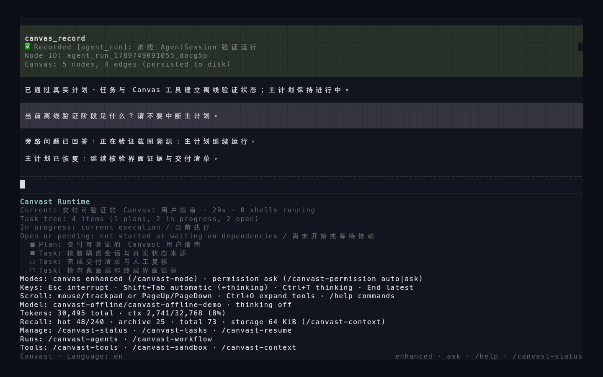
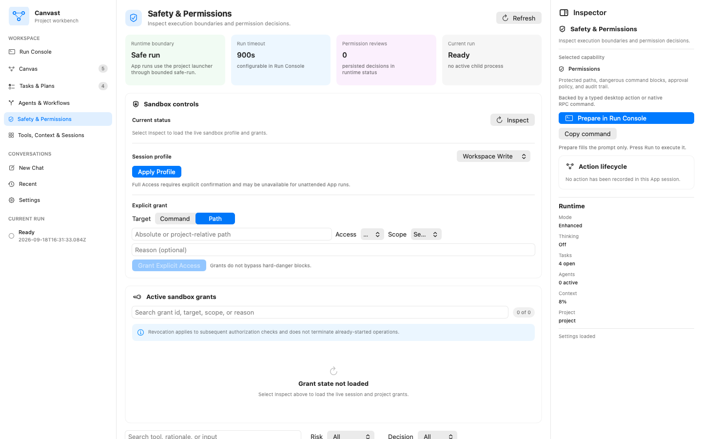
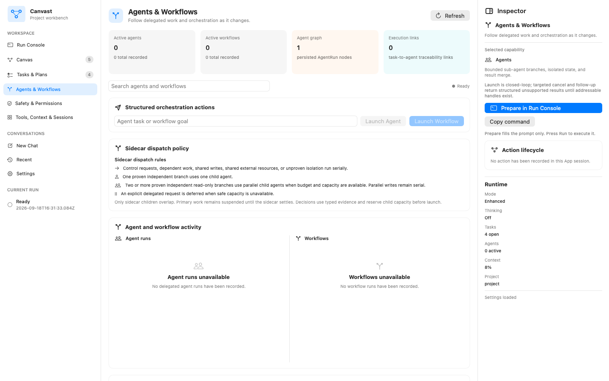
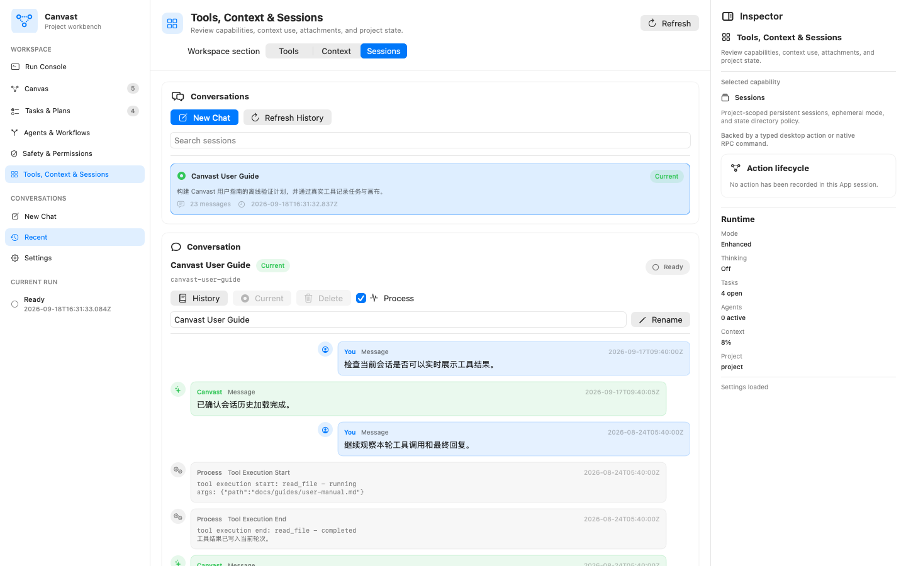
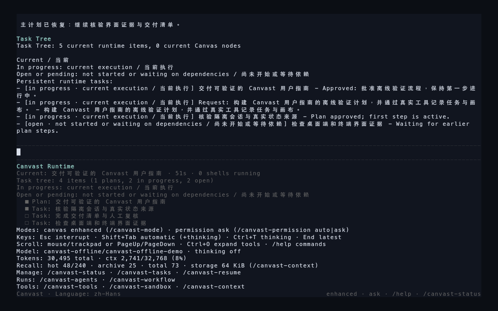
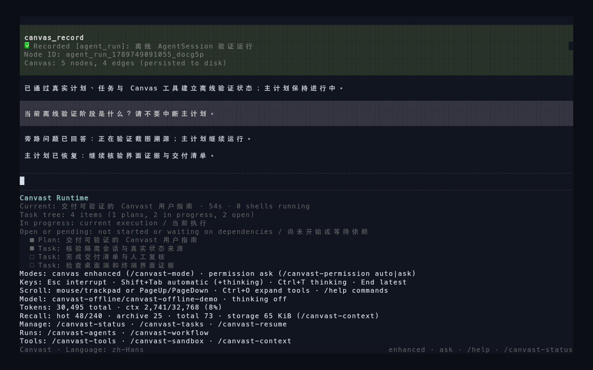
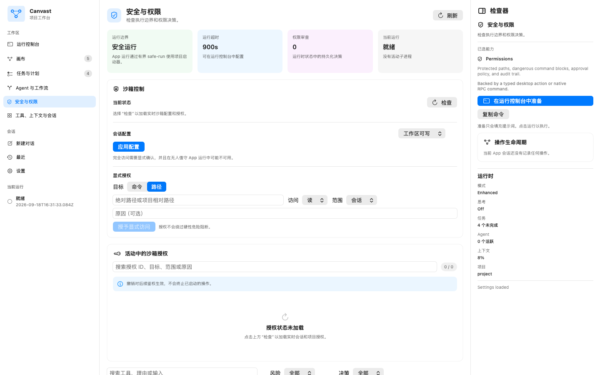
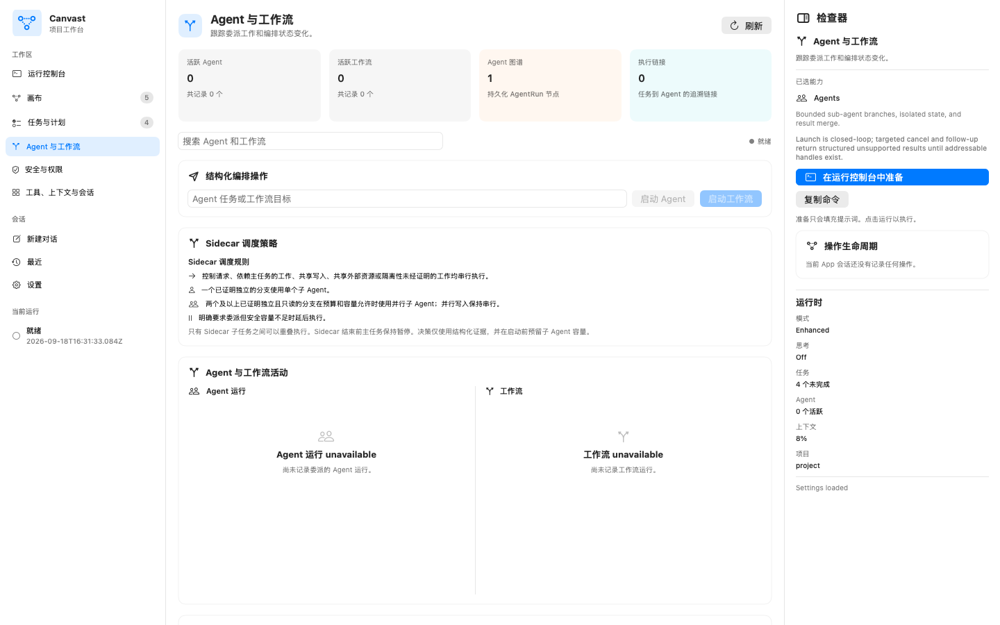
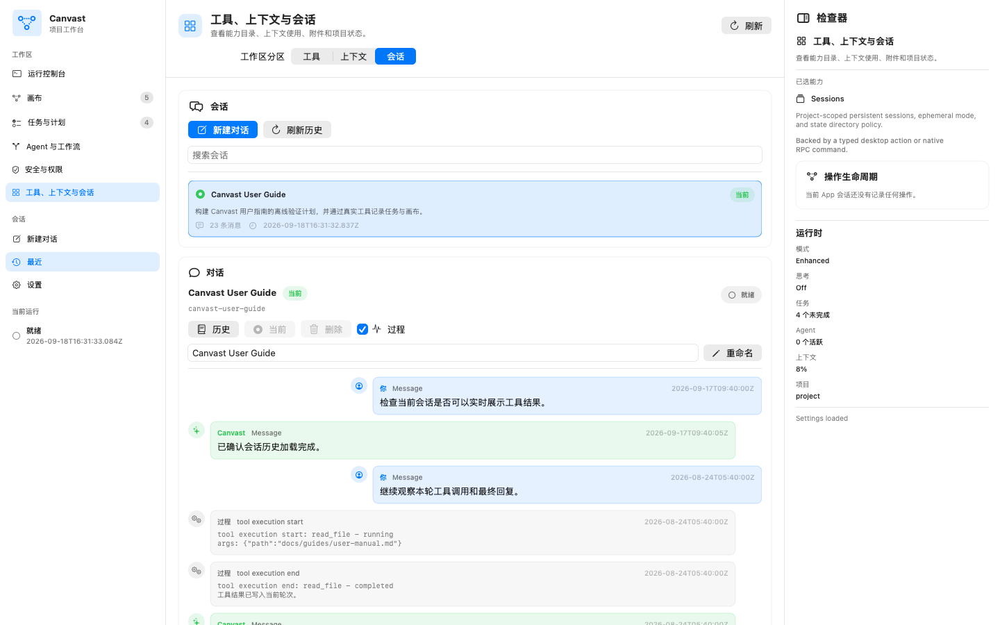

# Canvast

<p align="center">
  
</p>

<p align="center">
  <strong>Local-first AI coding workspace for sustained project work.</strong><br>
  面向持续项目工作的本地优先 AI 编程工作空间。
</p>

<p align="center">
  <a href="#english">English</a> ·
  <a href="#中文">中文</a> ·
  <a href="docs/guides/user-manual.md">User Manual</a> ·
  <a href="docs/EFFECTIVENESS_EVIDENCE.md">Effectiveness Evidence</a> ·
  <a href="https://github.com/cyberflax2020/canvast/releases">Releases</a>
</p>

## English

### What is Canvast

Canvast is an AI coding-agent harness built for work that outlives a single prompt. It runs on the open [pi](https://github.com/badlogic/pi-mono) runtime family and adds the governance layer long-running engineering work needs: project-scoped sessions you can actually resume, a persistent Canvas that records files, plans, decisions, and delegated agent runs as a typed graph, and a runtime whose every request, tool call, and approval stays visible and attributable.

One product, two surfaces: a fast terminal UI for steering active work, and a native SwiftUI macOS App that opens the same persisted project state as a full workspace.

### Why Canvast

- **Sustained context, not rebuilt context.** Reopen a project and continue from the same session history, task and plan state, transcripts, and resume candidates — hours or days later.
- **Governance you can see.** The Canvas records related files, plans, decisions, and agent runs with typed links, so multi-step work stays traceable instead of evaporating into chat scrollback.
- **A runtime that shows its work.** Request receipts, input queue, request lifecycle, tool runs, runtime events, and approval history are first-class, inspectable state — in the TUI and in the App.
- **Safety by default.** `read-only`, `workspace-write`, and `full-access` sandbox profiles; typed grant and revoke actions with recorded rationale; credential redaction; a resource watchdog and a single process-fence wrapper for heavy workloads.
- **Evidence over adjectives.** Product-outcome claims live in machine-checked evidence blocks (below) that a verifier re-derives from the checked-in record. What cannot be evidenced is marked inconclusive, not marketed.

### See it in action

The terminal runtime, steering a live run with real-time project status:


Live task and plan projection while the agent works, and the sidecar continuity view:

<p align="center">
  
  
</p>

Canvas with sandbox safety state in the TUI:


The macOS App — Run Console and the project Canvas, reading the same persisted state:

<p align="center">
  
  
</p>

<p align="center">
  
  
</p>

<p align="center">
  
  
</p>

### Advanced harness capabilities

- **28 governed extensions** on the pi runtime: sandboxed shell, file, and Git execution with identity pinning; in-process and isolated sub-agents with capacity limits; DAG workflows; background tasks; grounded web search and fetch with explicit evidence reasons; worktrees; code review; LSP fallback lookup; notebook editing; cron schedules; monitors; local HTML artifacts.
- **Resource-safety engineering.** A watchdog that bounds agent process count, CPU, and memory; a single process-fence wrapper (`safe-run.sh`) that owns teardown for heavy workloads; an owned-handle registry that pins PID, process group, and process birth time and fails closed on PID reuse.
- **Sealed runtime mode.** The relocatable launcher scrubs dozens of inherited environment variables (including dynamic-linker injection and TLS key-logging hooks) and pins a known TLS configuration before starting the agent.
- **Explicit, auditable skills.** Bundled skills ship disabled and can only be activated by name; unknown names are rejected.
- **Portable Canvas export.** Reproducible export of the persisted graph to JSON, Markdown, Mermaid, standalone SVG, and interactive HTML — from the CLI or natively from the App.

### Measured effectiveness

We evaluate Canvast in paired runs against Claude Code as the reference toolchain, with both sides driving the same DeepSeek API model. The methodology, thresholds, and full record are public; the block below is regenerated and verified by machine, and any claim outside it is rejected by our own release gate.

<!-- CANVAST_EFFECTIVENESS_EN_START -->
Paired evaluation: Canvast vs the reference toolchain (2.1.233 (Claude Code); bare print via local compatibility proxy). Both sides ran against the same DeepSeek API model, deepseek-v4-pro.
- Task success: Canvast 12/12; reference 12/12; pass-rate difference 0.0 percentage points; 0 discordant pairs across 12 complete pairs (24 side-runs) with four crossover repeats and zero infrastructure exclusions.
- Median run latency: Canvast 61138.5 ms; reference 40736.5 ms; ratio 1.5008x. This overhead is disclosed as a known optimization target for upcoming releases.
- Token accounting: not published, because cache telemetry was not trustworthy on at least one side.
- Model backend (project-owner attestation, 2026-09-18): Both sides of the paired evaluation ran against the same DeepSeek API model, deepseek-v4-pro. The Canvast side connected to the DeepSeek API directly; the reference toolchain (Claude Code 2.1.233) connected through the local compatibility proxy scripts/anthropic-openai-proxy.mjs, which performs Anthropic-to-OpenAI protocol translation only and forwards to the same DeepSeek account, endpoint, and model. The project owner manually confirms this same-backend configuration for every included run.
- Attestation scope: This human attestation closes the strictSameModelVerified concern for publication. Machine strict-revision observation remains unavailable through the reference compatibility proxy; this attestation supplements, not replaces, the machine check, which continues to report strictSameModelVerified=false.

Product capability probes:
- **Continuous primary work — inconclusive.** The current published record is not sufficient to confirm this product outcome.
- **Compaction continuity — inconclusive.** The current published record is not sufficient to confirm this product outcome.
- **Live plan visibility — inconclusive.** The current published record is not sufficient to confirm this product outcome.
- **Portable Canvas — inconclusive.** The current published record is not sufficient to confirm this product outcome.
- Boundary: each line reflects the current published product record and falls back to inconclusive when the checked-in record is not sufficient.
- Current scope and limits: [Effectiveness Evidence](docs/EFFECTIVENESS_EVIDENCE.md).
<!-- CANVAST_EFFECTIVENESS_EN_END -->

### Get started

**Option 1 — Terminal (TUI).** Requirements: Node.js `22.19.0` or newer and npm. The default provider uses `DEEPSEEK_API_KEY`; other supported providers need the matching key plus `CANVAST_PROVIDER` and `CANVAST_MODEL`.

```bash
# From a repository checkout (or download canvast-tui-0.1.0.tgz from Releases and extract it)
npm ci          # use npm install inside an extracted package
cp .env.example .env   # add DEEPSEEK_API_KEY
./canvast.sh
```

Then ask for the first outcome you want:

```bash
./canvast.sh -p "Summarize the current project state."
```

Useful views while working: `/canvast-status`, `/canvast-tasks`, `/canvast-canvas`.

**Option 2 — macOS App.** Requirements: macOS 13 or newer. Download `Canvast-macos-0.1.0.zip` from [Releases](https://github.com/cyberflax2020/canvast/releases), extract it, and move `Canvast.app` to Applications. The App embeds the sealed runtime — no separate Node.js install is required. The build is ad-hoc signed, so on first launch use right-click → Open; configure your provider key in Settings, pick a project, and continue in the Run Console.

Export the Canvas at any time:

```bash
npm run export:canvas -- --out ./canvas-export --title "Project Canvas"
```

### Documentation

| Topic | Document |
|---|---|
| Full guide | [User Manual](docs/guides/user-manual.md) · [中文指南](README.zh-CN.md) |
| Setup | [Configuration](docs/guides/configuration.md) |
| Verification model | [Verification and Evidence](docs/guides/testing.md) |
| Measured results | [Effectiveness Evidence](docs/EFFECTIVENESS_EVIDENCE.md) |
| Architecture | [Overview](docs/architecture/overview.md) · [Canvas and Traceability](docs/architecture/canvas-and-traceability.md) · [Runtime Orchestration](docs/architecture/runtime-orchestration.md) |
| Open-source base | [Open-Source Adoption Record](docs/architecture/open-source-adoption-record.md) |
| Network boundary | [External Services](docs/reference/external-services.md) |
| Contributing | [CONTRIBUTING.md](CONTRIBUTING.md) |
| Security | [SECURITY.md](SECURITY.md) |

### License

[Apache-2.0](LICENSE). Third-party components and their licenses: [THIRD_PARTY_NOTICES.md](THIRD_PARTY_NOTICES.md).

## 中文

### Canvast 是什么

Canvast 是一个为"超出单条提示词"的工作而生的 AI 编程 agent harness。它运行在开放的 pi 运行时之上，补齐持续工程工作所需的治理层：可真正恢复的项目级 session；把相关文件、计划、决策和委派的 agent 运行记录为 typed graph 的持久化 Canvas；以及一个每个请求、每次工具调用、每条审批都可见、可归因的运行时。

一个产品，两个界面：用于引导活跃工作的快速终端 TUI，以及把同一份持久化项目状态打开为完整工作空间的原生 SwiftUI macOS App。

### 为什么选择 Canvast

- **延续上下文，而不是重建上下文。** 重新打开项目时，继续沿用同一份 session 历史、任务与计划状态、transcript 和 resume candidate——哪怕相隔数小时或数天。
- **看得见的治理。** Canvas 用 typed link 记录相关文件、计划、决策与 agent 运行，多步骤工作全程可追溯，而不是消失在聊天记录里。
- **会展示自己在做什么的运行时。** request receipt、input queue、request lifecycle、tool runs、runtime events 和 approval history 都是一等可检查状态——TUI 和 App 里都能看到。
- **默认安全。** `read-only`、`workspace-write`、`full-access` 三档沙箱 profile；带记录理由的 typed grant 与 revoke；凭据脱敏；资源 watchdog 与统一的进程围栏包装器。
- **证据先于修辞。** 产品结果声明只出现在机器校验的证据区块中（见下），由 verifier 从已检入记录重新推导。无法证实的内容明确标记为结论未定，而不是拿去营销。

### 界面实录

终端运行时：引导一次活跃运行，实时项目状态可见：


agent 工作时的实时任务与计划投影，以及 sidecar 连续性视图：

<p align="center">
  
  
</p>

TUI 中的 Canvas 与沙箱安全状态：


macOS App:Run Console 与项目 Canvas，读取同一份持久化状态：

<p align="center">
  
  
</p>

<p align="center">
  
  
</p>

<p align="center">
  
  
</p>

### 高级 harness 能力

- **28 个受治理扩展**：带身份钉住的沙箱 shell、文件与 Git 执行；进程内与隔离子代理（带容量上限）;DAG workflow；后台任务；带显式证据理由的联网搜索与抓取；worktree；代码评审；LSP fallback 查询；notebook 编辑；cron 调度；监控器；本地 HTML artifact。
- **资源安全工程。** 限制 agent 进程数量、CPU 与内存的 watchdog；为重负载独占 teardown 的进程围栏包装器（`safe-run.sh`)；钉住 PID、进程组与进程出生时间、在 PID 复用时安全拒绝的 owned-handle 注册表。
- **密封运行时模式。** 可迁移启动器在启动 agent 前清除数十个继承环境变量（包括动态链接器注入与 TLS key-logging 钩子），并钉住已知 TLS 配置。
- **显式、可审计的 skill。** 内置 skill 默认关闭，只能按名启用；未知名称一律拒绝。
- **可移植 Canvas 导出。** 把持久化图谱可复算地导出为 JSON、Markdown、Mermaid、独立 SVG 与交互式 HTML——CLI 与 App 原生路径均可。

### 实测有效性

我们以 Claude Code 为参考工具链进行配对运行评估，两侧驱动相同的 DeepSeek API 模型。方法论、判定门槛与完整记录全部公开；下方区块由机器重新生成并校验，任何区块之外的相关声明都会被我们自己的发布门禁拒绝。

<!-- CANVAST_EFFECTIVENESS_ZH_START -->
配对评估：Canvast 对比参考工具链（2.1.233 (Claude Code)；bare print via local compatibility proxy）。两侧运行相同的 DeepSeek API 模型 deepseek-v4-pro。
- 任务成功率：Canvast 12/12；参考运行 12/12；通过率差值 0.0 个百分点；共 12 个完整配对（24 次单侧运行），四轮交叉重复、基础设施排除数为零，结果不一致的配对 0 个。
- 中位运行时长：Canvast 61138.5 毫秒；参考运行 40736.5 毫秒；比值 1.5008x。该开销已公开记录为后续版本的优化目标。
- Token 计量：不予发布，因为至少一侧运行的缓存遥测不可信。
- 模型后端（项目所有者人工确认，2026-09-18）：配对评估的两侧均运行相同的 DeepSeek API 模型 deepseek-v4-pro。Canvast 侧直接连接 DeepSeek API；参考工具链（Claude Code 2.1.233）通过本地兼容代理 scripts/anthropic-openai-proxy.mjs 接入，该代理仅执行 Anthropic 到 OpenAI 的协议翻译，并转发至相同的 DeepSeek 账户、端点与模型。项目所有者人工确认每一次纳入运行均为上述同后端配置。
- 确认范围：本人工确认用于终结发布流程中的 strictSameModelVerified 悬案。通过参考工具链的兼容代理仍无法进行机器级严格 revision 观测；本确认为机器检查的补充而非替代，机器检查继续报告 strictSameModelVerified=false。

产品能力探针：
- **主任务连续推进——结论未定。** 当前公开记录不足以确认这一产品结果。
- **压缩后连续执行——结论未定。** 当前公开记录不足以确认这一产品结果。
- **实时计划可见——结论未定。** 当前公开记录不足以确认这一产品结果。
- **可移植 Canvas——结论未定。** 当前公开记录不足以确认这一产品结果。
- 边界：每一行都只反映当前已发布的产品记录；当已检入记录不足时，会明确标记为结论未定。
- 当前范围与限制说明见：[有效性证据](docs/EFFECTIVENESS_EVIDENCE.md)。
<!-- CANVAST_EFFECTIVENESS_ZH_END -->

### 快速开始

**方式一：终端（TUI)。** 环境要求：Node.js `22.19.0` 或更高版本与 npm。默认 provider 使用 `DEEPSEEK_API_KEY`；其他受支持 provider 需要匹配的 key，以及 `CANVAST_PROVIDER`、`CANVAST_MODEL`。

```bash
# 仓库 checkout（或从 Releases 下载 canvast-tui-0.1.0.tgz 并解压）
npm ci          # 解压后的 package 内使用 npm install
cp .env.example .env   # 写入 DEEPSEEK_API_KEY
./canvast.sh
```

然后直接请求你要的第一个结果：

```bash
./canvast.sh -p "Summarize the current project state."
```

工作中常用的视图：`/canvast-status`、`/canvast-tasks`、`/canvast-canvas`。

**方式二：macOS App。** 环境要求：macOS 13 或更高版本。从 [Releases](https://github.com/cyberflax2020/canvast/releases) 下载 `Canvast-macos-0.1.0.zip`，解压后将 `Canvast.app` 移入"应用程序"。App 内嵌密封运行时，无需单独安装 Node.js。构建为 ad-hoc 签名，首次启动请右键 → 打开；在 Settings 中配置 provider key，选择项目，即可在 Run Console 中继续工作。

随时导出 Canvas:

```bash
npm run export:canvas -- --out ./canvas-export --title "Project Canvas"
```

### 文档导航

| 主题 | 文档 |
|---|---|
| 完整指南 | [用户手册](docs/guides/user-manual.md) · [中文指南](README.zh-CN.md) |
| 安装配置 | [配置指南](docs/guides/configuration.md) |
| 验证模型 | [验证与证据](docs/guides/testing.md) |
| 实测结果 | [有效性证据](docs/EFFECTIVENESS_EVIDENCE.md) |
| 架构 | [总览](docs/architecture/overview.md) · [Canvas 与溯源](docs/architecture/canvas-and-traceability.md) · [运行时编排](docs/architecture/runtime-orchestration.md) |
| 开源基础 | [开源采用记录](docs/architecture/open-source-adoption-record.md) |
| 网络边界 | [外部服务边界](docs/reference/external-services.md) |
| 参与贡献 | [CONTRIBUTING.md](CONTRIBUTING.md) |
| 安全 | [SECURITY.md](SECURITY.md) |

### 许可证

[Apache-2.0](LICENSE)。第三方组件及其许可证见 [THIRD_PARTY_NOTICES.md](THIRD_PARTY_NOTICES.md)。
