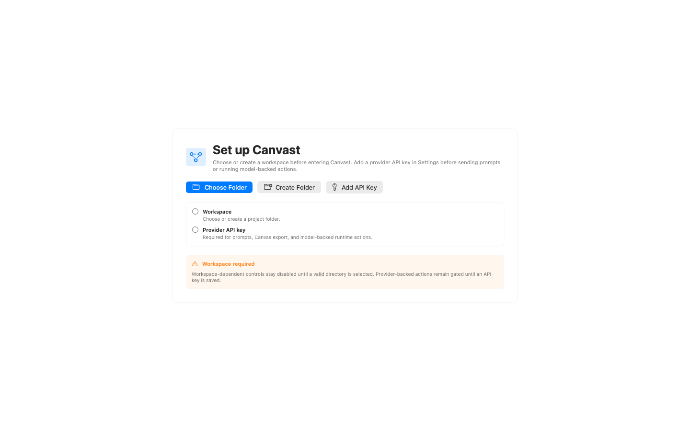
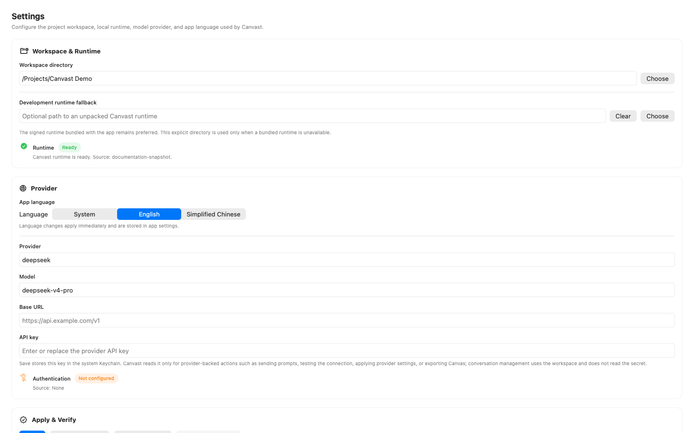
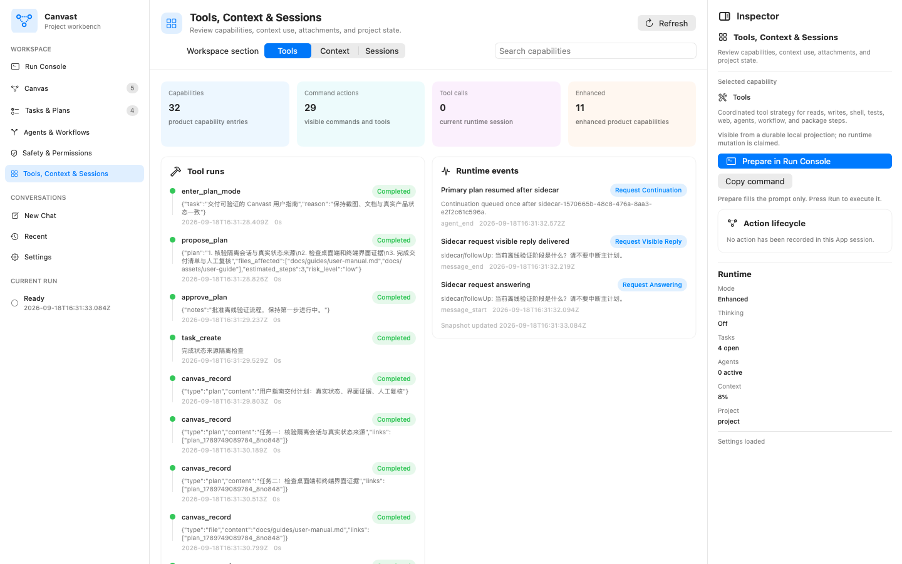
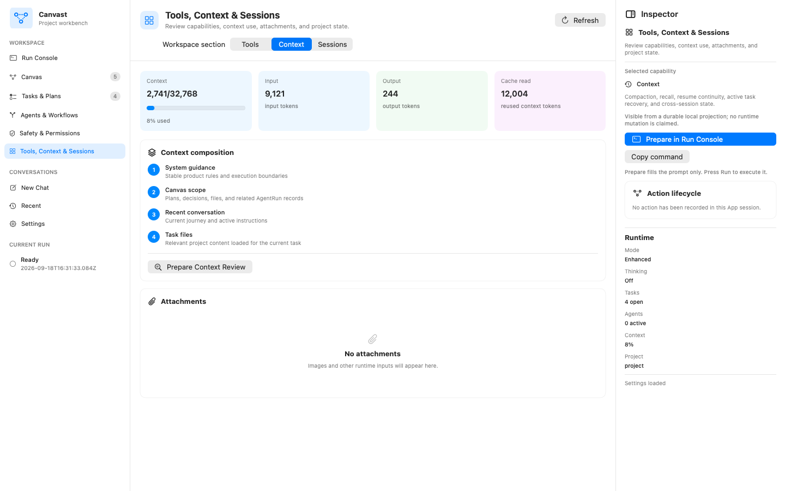
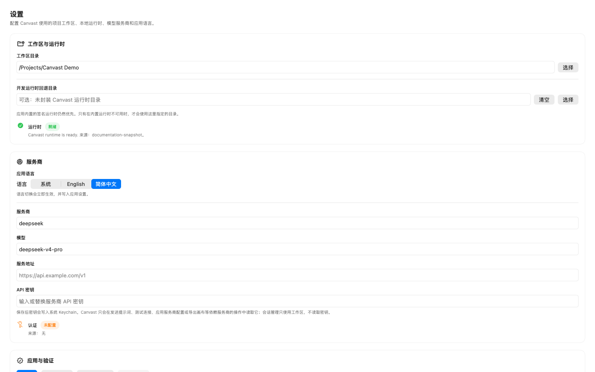
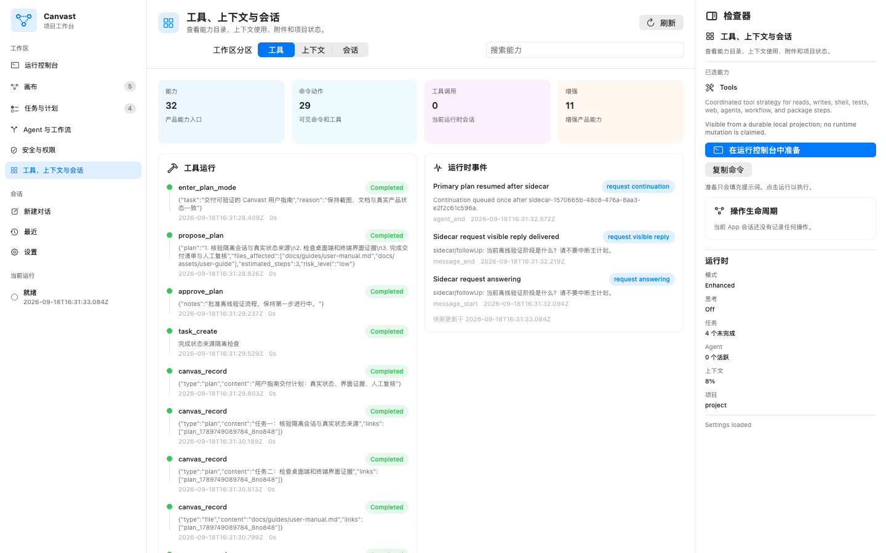
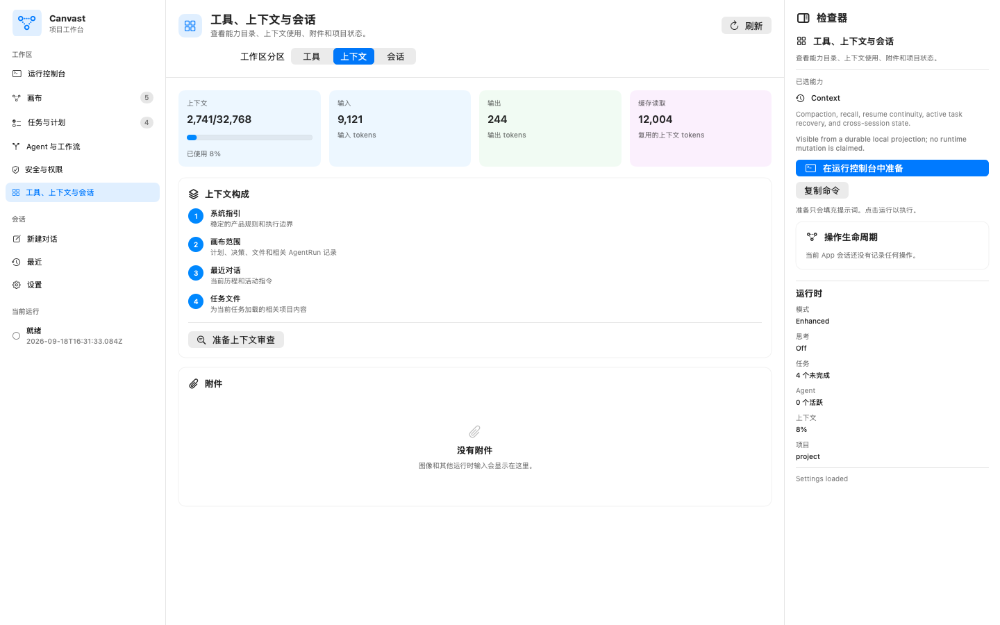

# Canvast User Manual

## English

This manual covers the Canvast terminal interface, CLI, native macOS App, persistent Canvas, and bundled runtime tools.

### 1. Capability labels used in this guide

Canvast exposes several kinds of controls. Read these labels literally:

- **Direct control** performs the named action from the current UI.
- **Agent tool** is callable by the active agent after normal orchestration and permission checks; it is not necessarily a slash command or desktop button.
- **State view** reads persisted runtime or Canvas state and does not mutate it.
- **Prepare** writes a request into Run Console for review; it does not execute the request.
- **Degraded** has a deliberately narrower implementation than its label might suggest. Its limitation is stated in this guide.
- **External** is discoverable in the desktop capability catalog but has no deterministic desktop action. Use the TUI/agent tool or the documented script instead.

Screenshots use sanitized sample data, so names, timestamps, and task contents may differ from a live session. The checked-in screenshot set is illustrative, not a guarantee that every image reflects the latest controls; treat it as product guidance unless screenshot verification is rerun.

### 2. Requirements, installation, and secrets

Requirements:

- Node.js 22.19 or newer
- npm
- Python 3 for bundled-skill verification
- macOS 13 or newer for the native App
- `DEEPSEEK_API_KEY` or `ANTHROPIC_API_KEY` for model-backed runs

For a repository checkout that includes `package-lock.json`, install the exact locked dependency graph:

```bash
npm ci
```

An extracted npm package does not include the repository lockfile. Install its declared dependency graph with:

```bash
npm install
```

Copy the configuration template in that checkout or extracted package:

```bash
cp .env.example .env
```

Add `DEEPSEEK_API_KEY` to `.env` for the default provider, or set a supported provider, model, and matching key in the environment. An environment variable supplied by the invoking process wins over the local `.env` fallback. Never commit `.env` or `.canvast-secrets/`, and never place a key directly in a command-line argument. Then start Canvast:

```bash
./canvast.sh
```

Unless explicitly overridden, the launcher selects provider `deepseek`, model `deepseek-v4-pro`, and thinking level `high`. Managed component auto-download is disabled by default: the launcher sets `PI_OFFLINE=1` unless it was already set or `CANVAST_ALLOW_COMPONENT_AUTO_DOWNLOAD=1` explicitly opts into that network behavior.

### 3. Project scope and persistent state

The launcher exports the invocation directory as `CANVAST_WORKING_DIR` unless that variable is already set. Canvast treats that directory as the starting point and walks upward to the nearest project marker such as `.git`, `package.json`, `pyproject.toml`, `go.mod`, `Cargo.toml`, or `pnpm-workspace.yaml`. Set `CANVAST_PROJECT_ROOT` when that inference is not the intended project.

Normal sessions use a project-scoped directory under `CANVAST_HOME`; different project roots therefore do not share session or Canvas state accidentally. `--no-session` creates process-scoped ephemeral state and does not use the persistent session directory.

Useful launches:

```bash
./canvast.sh
./canvast.sh -p "Summarize the current project state."
./canvast.sh --mode json -p "List the open tasks."
./canvast.sh --no-session -p "Run one bounded request."
./canvast.sh --canvast-sandbox workspace-write -p "Inspect this repository."
./canvast.sh --canvast-unattended -p "Run without interactive approval prompts."
```

Interactive TUI is the default. `-p` is a bounded print-mode request. `--mode json` emits structured host output; hidden thinking fields are removed unless `CANVAST_EXPOSE_THINKING=1` is explicitly set.
`--canvast-unattended` disables interactive approval prompts for that launch; `--no-canvast-unattended` explicitly restores interactive behavior when a UI is available.

Product UI text defaults to English. Dynamic runtime labels switch locale only through an explicit locale setting, such as `CANVAST_RUNTIME_LOCALE` or `CANVAST_UI_LOCALE`, or through the recorded language state detected from user input or model output. The language of a task prompt does not authorize hard-coded product text in another locale; task content and runtime locale policy remain separate.

### 4. TUI tour


The TUI installs a Canvast header and footer, the normal prompt/transcript, command panels, and a live runtime widget. The widget refreshes from persisted runtime state and shows:

- the active real plan or task, elapsed time, and active shell count;
- a real plan/task tree with done, in-progress, open, and interrupted counts;
- pending sidecar/status/control inputs and their routing policy;
- Standard/Enhanced and Ask/Auto modes;
- provider, model, thinking level, token and context-window usage;
- hot/archive recall counts and storage size; and
- active sub-agent, workflow, tool, attachment, and latest approval summaries when present.

When a real plan or real tasks exist, the widget prioritizes those records. The synthetic `current-user-request` row is only a fallback; it is not presented as a fabricated plan. A newly projected orchestration plan immediately marks its first executable step `in_progress`, and later status writes are reflected by the widget rather than waiting for the turn to finish.

Elapsed time is derived only from persisted `startedAt`, `completedAt`, or `elapsedMs` fields on task, plan, sub-agent, and workflow records. The expanded `/canvast-status` view reports the shared usage projection's total, effective, input, output, cache-read, and cache-write tokens; context-window used, remaining, and ratio values; turn and tool-call counts; and provider/runtime cost when supplied. Missing usage or timing data remains `unknown` or the persisted zero/default value—it is never replaced with a fabricated estimate.

Keyboard and navigation controls:

| Control | Effect |
|---|---|
| `Esc` | Interrupt the active run |
| `Shift+Tab` | Toggle the Canvast automatic tuple (enhanced + auto permission + unattended); the key is still forwarded to the host thinking control |
| `Ctrl+T` | Change thinking level through the host control |
| `PageUp` / `PageDown` | Scroll transcript history by one page |
| `Ctrl+O` | Expand or collapse long tool/panel output |
| `End` | Return to the newest transcript output |
| Mouse/trackpad scroll | Browse history without being forced back to the top |

Long pasted text of at least 4,000 characters is stored in the project-scoped editor attachment area. Images and long text use stable, copyable placeholders with these forms:

```text
[canvast:image:<index>:<mime>]
[canvast:text:<12-character-sha256-prefix>:<length>chars]
```

When a long-text placeholder is submitted, Canvast supplies the original text to the model in this structured form:

```text
[canvast:text:<hash>:<length>chars]

<canvast-long-text placeholder="[canvast:text:<hash>:<length>chars]" chars="<length>">
<original text>
</canvast-long-text>
```

The visible placeholder remains an editable text handle. Expansion into the structured block happens at submit time; the current TUI does not render a graphical editor chip. Image attachments are forwarded only when the active model advertises image input; otherwise the TUI records an explicit omitted-attachment notice and asks the user to use an image-capable model or describe the image in text.

### 5. Sidecar follow-ups and turn continuity


While tracked work is active, ordinary new input is recorded as a **sidecar by default**; it does not replace the current primary request or plan merely because the user asked another question. On host streaming-input paths it is re-delivered as `followUp`; otherwise the host's existing input-delivery path continues while the runtime projection preserves its sidecar identity and lifecycle. Its lifecycle is visible as `queued`, `delivered`, `answering`, then `answered`. After the visible sidecar answer, Canvast queues at most one hidden continuation for that sidecar so the unfinished primary plan resumes without repeating completed side effects or the sidecar question.

Interrupting or redirecting the primary work is still valid when it is explicit. Trusted integrations can attach versioned `canvast.runtime-request-control/v1` metadata, or send `/canvast-request-control POLICY TEXT`, with one of these policies:

| Policy | Primary work | Intended use |
|---|---|---|
| `sidecar` | Preserved | Normal independent follow-up |
| `status` | Preserved | Progress/status question |
| `pause` | Affected | Explicitly pause current work |
| `redirect` | Affected | Replace direction or objective |
| `task_adjustment` | Affected | Modify the active task/plan |

Malformed or unversioned metadata is ignored. The slash transport rejects an unknown policy or empty request with a visible warning and does not enqueue it. Runtime request-control routing does not infer `pause`, `redirect`, or `task_adjustment` from ordinary prose; those effects require explicit versioned metadata or the control command. `Esc`, an explicit new-session action, or an explicit structured control may intentionally stop or replace work.

Sidecar execution is also deterministic. Control requests, work that depends on mutable primary state, inter-branch dependencies, shared writes/resources, or any case with unproven isolation stays serial. Delegation requires typed per-branch evidence: a unique branch ID for each branch plus self-contained input, branch dependency, write-target, and external-resource keys. One proven independent branch uses `spawn_agent`; two or more proven read-only branches use `parallel_agents`, subject to the live child-owner capacity and the current budget. Every parallel task must explicitly set `read_only=true`, and its LLM child receives only read-only tools. Any declared write target keeps the branch set serial until isolated worktrees and a merge owner are implemented. The latest decision revision, reason codes, execution state, tool-call correlation ID, logical child run IDs, and per-branch evidence are persisted and shown in runtime events and `/canvast-agents`. Current agent tools wait for their children, so this is child fan-out inside the sidecar: the primary remains suspended and Canvast reports `primary_overlap=false`.

In this policy, serial means “finish this follow-up while primary work is suspended, then resume primary work.” `spawn_agent` is reserved for exactly one recorded self-contained branch; `parallel_agents` requires at least two independent recorded branches and an exact match between the recorded branch IDs and submitted task IDs. The runtime uses typed request metadata and isolation evidence, never keyword matching on the message text.

Context compaction preserves the active project, session, request, turn, plan/task tree, sub-agent/workflow/tool projections, and input queue. Its runtime checkpoint contains the active task, plan, sub-agent, workflow, and tool-run IDs; the separately persisted Canvas graph is left intact. If the host reports `willRetry=true`, the host-native retry owns continuation and Canvast does not send a duplicate retry; the next turn start is recorded as the same-turn native retry. For a successful compaction with `willRetry=false`, the harness owns continuation and dispatches one hidden `canvast-compaction-continuation` after the committed record. The durable operation ID and processed-event set suppress duplicate dispatch, including reload/event replay. If compaction fails or settles without a committed record, Canvast records a recoverable failure and available recovery actions instead of silently declaring the task complete. External side effects cannot be rolled back automatically, so resumed work is instructed to continue only unfinished steps.

Recall is pointer-first: summaries need not keep all original text resident in the active prompt. The project-scoped `context-recall/index.json` stores hot records and recovery pointers to session/entry locations or bounded local excerpts; older summary records and their source pointers move to `context-recall/archive-index.json`. `/canvast-context` discloses hot/archive counts and recent entry or excerpt references when available, so users can see where source text can be recovered instead of assuming it was retained inline.

### 6. TUI command reference

Most `/canvast-*` panels are **state views**. They do not create tasks, spawn agents, or run workflows by themselves; those operations are agent tools described in the next section.

| Command | Actual behavior |
|---|---|
| `/canvast`, `/help`, `/canvast-help` | Open the main surface or command map |
| `/canvast-status` | Read the persisted live runtime projection |
| `/canvast-canvas [NODE]` | Render the Canvas; also accepts `focus NODE`, `type TYPE`, `search TEXT`, `page N`, and `limit N` |
| `/canvast-tasks` | Show real runtime plans/tasks plus persisted Canvas plan links |
| `/canvast-agents` | Show recorded agent runs and runtime sub-agent executions |
| `/canvast-workflow` | Show recorded workflow runs and usage guidance |
| `/canvast-tools` | Show coordination policy and active tool/shell runs |
| `/canvast-context` | Show context, compaction, recall, and resume state |
| `/canvast-sandbox` | Inspect the sandbox profile, permission mode, grants, and reviews |
| `/canvast-safety` | Show safety guidance; it does **not** start the watchdog |
| `/canvast-web` | Show web-research policy; it does not browse by itself |
| `/canvast-components` | Inspect bundled component status; it does not update components |
| `/canvast-features`, `/canvast-feature <ID\|TITLE>` | Browse the capability catalog or open one capability by ID, exact title, or hyphenated title |
| `/canvast-mode parity|enhanced|status` | Persist or inspect Canvast mode |
| `/canvast-permission ask|auto|status` | Change or inspect session permission mode |
| `/canvast-thinking LEVEL|status` | Change or inspect thinking level when the host supports it |
| `/canvast-request-control POLICY TEXT` | Send explicit `sidecar`, `status`, `pause`, `redirect`, or `task_adjustment` control |
| `/sandbox status|ask|auto|read-only|workspace-write|full-access` | Inspect or change the real sandbox/permission control |
| `/canvas-task NODE_ID` | Select the active Canvas task and scoped context |
| `/canvas-plan PLAN_ID` | Select the approved plan used for tool-scope enforcement |
| `/canvast-project status|rebind` | Inspect or explicitly rebind project-scoped Canvas state |

There is no separate `/canvast-plan` panel command. Plan visibility is intentionally shared by `/canvast-tasks`, `/canvast-status`, and `/canvast-canvas`; `/canvas-plan PLAN_ID` is the explicit scope-selection command, not a plan browser. If the active model does not publish a thinking-level map, the displayed fallback choices are `minimal`, `low`, `medium`, `high`, `xhigh`, and `max`; the host still decides whether a requested level is accepted.

Host commands retained by the TUI include `/hotkeys`, `/settings`, `/model`, `/session`, `/tree`, `/compact`, and `/reload`. Session controls are intentionally different:

- `/new` is the host-native new/reset session operation.
- `/canvast-new` clears stale visible runtime-session rows while retaining the project Canvas and recall archives.
- `/restart` and `/canvast-restart` reinstall the Canvast header, footer, editor, widget, and synchronized runtime view without clearing project memory.

### 7. Plans, tasks, agents, workflows, and background work


The agent uses `enter_plan_mode`, `propose_plan`, `approve_plan`, and `exit_plan_mode` for explicit plan mode. A proposed plan is pending; file changes should not begin until approval. Approval marks the plan and first executable step active. `exit_plan_mode` records an approved plan and all projected steps as `completed`, or an unapproved plan as blocked; this is plan-mode bookkeeping, not independent verification that every step ran successfully.

The task tools are `task_create`, `task_update`, `task_list`, and `task_get`. For detailed tasks present in the current extension session, unfinished dependencies prevent transition to `in_progress` or `completed`. Persisted projection-only fallback updates do not reconstruct the dependency graph and therefore do not enforce that check. Detailed task objects live in the current extension session; their summaries are also mirrored to persisted runtime status for UI visibility and recovery.

Delegation and execution limits are separate:

| Facility | Behavior and hard boundary |
|---|---|
| `spawn_agent` / `parallel_agents` | Isolated child state, no recursive spawn extensions, maximum **2** process children across spawn tools, 50,000-character inline result cap |
| `run_workflow` | Sequential, parallel, or DAG steps; dependency validation and cycle/block reporting; maximum **2** concurrent steps; 50,000-character step-output cap |
| `bg_bash` | Maximum **4** running background processes; stdout and stderr each retain a bounded 512 KiB head/tail view |
| Background history | At most **32** task records; inspect with `task_status`, `task_output`, and `task_list_bg`, stop with `task_stop` |

Sub-agent and workflow child processes are isolated and use timeout cleanup of their process groups. `/canvast-agents` and `/canvast-workflow` show projections; they are not launch buttons. The local `list_agents` registry is not a complete inventory of every process spawned by `spawn_agent`, so use runtime status plus tool results when auditing execution.

### 8. Canvas: record, inspect, scope, and export


The persistent Canvas stores four node types: File, Plan, Decision, and AgentRun, together with typed traceability edges. `canvas_record` creates a node and optional links; `canvas_query` searches, traces up to a bounded depth, or reports graph statistics. `canvas_repomap` scans a bounded source set and returns a structural summary; its symbol extraction is a lightweight language-pattern fallback, not a full semantic index.

The TUI is an inspection surface, not a free-form graph editor. Use `/canvas-task` and `/canvas-plan` to select active scope/enforcement records. Use `/canvast-project rebind` only when intentionally attaching persisted Canvas state to the current project root.

Large graphs are bounded rather than dumped into one screen. The current TUI starts with compact layer summaries and a local page, then uses the documented `type`, `search`, `focus`, `page`, and `limit` forms to reveal a useful subset; `/canvast-tasks` returns to the current plan/task progress view. There is no dedicated per-layer collapse/expand command or one-step “return to current task” Canvas command in the current TUI grammar. Per-layer folding and a direct path back to the current task remain large-graph navigation requirements, not additional commands claimed by this manual. The desktop Canvas separately provides **Focus** and **Show All** for its displayed neighborhood.

Use the CLI when you need a reproducible static export. The native App also exposes a source-backed export action for the loaded graph, but the CLI command remains the canonical documented path:

```bash
npm run export:canvas -- --out ./canvas-export --title "Project Canvas"
```

The output is `canvas-graph.html`, `canvas-graph.svg`, `canvas-graph.mmd`, `canvas-report.md`, and `canvas-graph-export.json`. SVG, Mermaid, Markdown, and JSON are static. The HTML viewer may load D3 from a CDN. Treat all exports as generated artifacts and review project names and paths before sharing them.

### 9. Sandbox, permissions, web, and resource safety

Sandbox profiles are `read-only`, `workspace-write` (default), and `full-access`. Permission mode is `ask` or `auto`:

- **Ask** may display a prompt when an interactive UI is available.
- **Auto** never waits for a prompt: bounded low-risk decisions can be approved by policy, while higher-risk boundaries return a structured block.
- Hard-dangerous operations remain blocked in every mode. Protected-path access requires explicit approval: Ask mode may authorize the current operation once or record a session/project path grant, while Auto or unattended mode blocks when policy cannot approve the boundary.
- Grants may be one-shot, session-scoped, or project-scoped. Full access requires Ask mode and an interactive approval; it is unavailable in unattended mode.

Every persisted approval review pairs its decision with **risk**, **authorization**, and a user-facing **rationale**. The detailed approval-review surfaces—`/canvast-sandbox` and desktop Safety & Permissions—display those three fields together; compact status summaries may abbreviate the record.

Web research is source-aware: Canvast prefers primary sources for exact claims, cites the URLs it used, and reports unverified boundaries when a source cannot be confirmed. Search and fetch distinguish empty results from transport, timeout, HTTP, parsing, and invalid-request failures. Domain allow/block filters and bounded external-call budgets are available for focused research.

For long or resource-intensive commands, use the bundled safety wrapper:

```bash
./scripts/safe-run.sh --timeout 900 -- <command>
```

The wrapper checks process and memory conditions, applies the timeout, and cleans up only the process tree it owns. If it refuses a launch, read the reported condition before retrying. For a stuck Canvast background task, inspect it with `task_status <task-id>` or `task_output <task-id>`, then stop it with `task_stop <task-id>`. Avoid broad process-name kills that could affect unrelated applications. `/canvast-safety` explains the active safeguards but does not start a command.

### 10. Agent tool catalog and honest boundaries

These tools are available to the active agent. User intent, plan scope, sandbox, and permission policy still apply.

| Area | Tools | Boundary |
|---|---|---|
| Local discovery | `find`, `content_search` | Bounded project search |
| Orchestration | `auto_orchestration_decision`, `canvast_mode` | Records structured mode/plan/workflow decisions |
| Canvas | `canvas_record`, `canvas_query`, `canvas_repomap` | Persistent graph plus bounded structural scan |
| Planning/tasks | `enter_plan_mode`, `propose_plan`, `approve_plan`, `exit_plan_mode`, `task_create`, `task_update`, `task_list`, `task_get` | Agent tools, not slash commands |
| Delegation/workflow | `spawn_agent`, `parallel_agents`, `run_workflow`, `send_message`, `list_agents` | Bounded execution with explicit capacity limits; `list_agents` is only a session-local registry |
| Shell/background | sandboxed `bash`, `bg_bash`, `task_status`, `task_output`, `task_stop`, `task_list_bg` | Subject to sandbox and resource bounds |
| Web | `web_search`, `web_fetch`, `web_research` | Explicit evidence reason and structured failure states |
| User interaction | `ask_user` | Structured options; text fallback when no native chooser is visible |
| Review | `code_review`, `report_findings`, `report_update`, `report_list` | Findings stay in the current session and are not part of Canvas or runtime state. `report_update` does not provide a durable workflow status change. `code_review` is lightweight static analysis, not a compiler or full AI audit |
| Code intelligence | `lsp` | Bounded fallback lookup; hover is informational, not a live LSP transport |
| Notebook | `notebook_edit` | Replace, insert, or delete notebook cells |
| Git/worktrees | `git_status`, `git_checkpoint`, `enter_worktree`, `exit_worktree`, `list_worktrees` | Checkpoint stages all changes; worktree removal can be forced only explicitly |
| Artifacts | `create_artifact` | Writes standalone local HTML under `.canvast-artifacts/` |
| Schedules | `cron_create`, `cron_list`, `cron_delete` | Session-only; only `*/N * * * *`, for 1–1440 minutes, is accepted |
| Monitoring | `monitor_start`, `monitor_stop`, `monitor_list` | Registration and lifecycle work; change notification/output-diff delivery is not a completed user-facing channel |
| MCP | `mcp_register`, `mcp_list` | Registry only; no stdio transport and no server tools are exposed |
| Usage | `usage_stats` | Runtime usage and cost estimates when the provider supplies the required data |

### 11. Optional project contract skill

Bundled custom skills are off by default and cannot be invoked implicitly. Enable the project contract skill for a run that needs structured goals, acceptance criteria, and progress records:

```bash
./canvast.sh --canvast-skill project-contract-harness -p "Create a project contract with goals and acceptance criteria."
```

The skill adds a project-local contract workflow and helpers; it does not replace Canvast's built-in plan, task, Canvas, sandbox, resource, web, or continuity controls. Unknown names and paths outside `skills/manifest.json` are rejected.

### 12. Native macOS App

The native macOS App is distributed separately from the npm package. It opens the selected project's persisted Canvast state and presents a sidebar, a main workspace, and an Inspector. Refresh reloads runtime and Canvas snapshots from disk. The visible desktop modes are Standard and Enhanced; Standard matches the command-line compatibility token `parity`.

On first launch, Canvast requires a usable workspace before it opens the workbench. A saved provider API key is still required before sending prompts, exporting Canvas, or starting model-backed runtime actions, but conversation management itself can work from the selected workspace without reading the secret.



Use **Choose Folder** to open an existing project folder, or **Create Folder** to make a new workspace. Use **Add API Key** or the Settings command to open the same settings window. Until a workspace is ready, workspace-dependent controls stay disabled or return a local setup-required message. Until an API key is saved, provider-backed controls show a local credential-required message before dispatching work.



Settings stores the API key in the system Keychain and keeps only a non-secret provider marker in the App settings file. Reopening the App checks credential availability without reading the secret value. Use **Save** to persist local settings and the key; use **Apply Provider** when the runtime host should switch to the selected provider/model/base URL.

macOS may ask whether Canvast can access the saved Keychain item when a provider-backed action needs the stored key. Allowing access lets that send, test, apply, or export action continue; choosing **Always Allow** avoids repeated prompts for the same item. Denying access does not delete the saved key, but the current provider-backed action cannot read it and will remain blocked until the key is allowed or re-saved. Creating, opening, renaming, deleting, and loading conversation history do not read the secret.

The current desktop surface is summarized below:

| Workspace | What you can do now |
|---|---|
| Run Console | Start a prompt, send follow-up or steer input, stop the active run, change thinking level, and submit typed request-control actions |
| Canvas | Search, filter, pan, zoom, Fit, Refresh, inspect links, focus on a neighborhood, select the active plan/task through explicit controls, and export the loaded graph |
| Tasks & Plans | Browse persisted plan/task state, create items, update task status through typed actions, approve or complete the current plan, and open matching Canvas nodes |
| Agents & Workflows | Inspect recorded activity and launch new work; targeted cancel or follow-up remains degraded until the runtime exposes stable addressable handles |
| Safety & Permissions | Inspect sandbox state and grants, review recorded approval decisions, and use supported permission/profile controls |
| Tools, Context, and Sessions | Browse the capability catalog and observability views, inspect context/session state, reload persisted snapshots, and manage saved sessions or project lifecycle through explicit controls |

All desktop actions use typed requests through the project RPC host. A visible control should be treated as real only when both the current App wiring and the runtime support it; otherwise the App returns a structured unsupported or degraded result instead of pretending success.

#### Run Console


Run Console keeps one project-scoped local host available while the App is in use. Use it for prompts, follow-up or steer input, explicit request-control policies, and active-run abort. Its output surfaces are projections of the same active conversation state used by Sessions, so the Turn view, Console view, and latest conversation pane should show the same user input, visible process/tool events, tool results, and final assistant reply even after restarting the App or switching workspaces. If a request may have been sent but no definitive result can be confirmed, the App keeps that action in a review-required flow instead of silently assuming success or failure.

The default **Turn** view groups each live turn as user input, visible process updates, tool-call status and results, and the final assistant reply. The final reply renders Markdown and stays at the bottom of its turn as streaming completes. Hidden chain-of-thought is not displayed; only public progress summaries and tool/result text emitted by the runtime are shown. **Console** shows the same conversation facts in a diagnostics-friendly stream, with adjacent multiline output kept together and local system/errors interleaved. **Requests** shows request lifecycle details.

#### Canvas


Desktop Canvas is a read-only view of the durable graph for search, filtering, pan/zoom, Focus, link inspection, and explicit scope selection. Clicking the graph changes visual focus only. The App also exposes a Canvas export toolbar with an output-folder field, **Export**, receipt/status reporting, and conditional **Cancel** support. The CLI remains the canonical reproducible path for a shareable static export:

```bash
npm run export:canvas -- --out ./canvas-export --title "Project Canvas"
```

#### Tasks & Plans


This page reads persisted plan/task state, filters it, and can open matching traceability nodes on Canvas. Creating items, approving or completing the current plan, and explicit task status changes use typed actions. Pure row selection and **Show on Canvas** navigation do not mutate runtime state.

#### Agents & Workflows


This page shows active and historical agent/workflow projections plus related Canvas traceability. Launch actions are source-backed. Targeted cancel or follow-up is still degraded and may return an unsupported result when the runtime has no stable handle for that work.

#### Safety & Permissions


Use this page to inspect sandbox state, review approval history, and send supported permission/profile/grant actions. High-risk requests still fail closed when the current operating mode cannot authorize them; the desktop App does not bypass interactive approval rules.

#### Tools, Context, and Sessions



Tools is a searchable capability catalog and observability surface. The catalog contains product capabilities rather than release-engineering artifacts, and each card describes whether it opens a page, prepares a command, copies a command, or displays read-only information.



Context shows persisted project state, resume candidates, and explicit project lifecycle controls. Refresh reloads local state snapshots; visible timestamps reflect the recorded snapshot time, not the current clock.


Sessions uses a chat-first layout: the session list supports search, switching, creation, and deletion of non-active sessions; the main pane shows the current transcript and run status; the bottom composer sends the next message through the controlled runtime path. The idle composer is the same draft used by Run Console's prompt editor, and the active-run follow-up composer is the same draft used by Run Console's request-control input. When setup is incomplete, these controls remain locked with a local explanation instead of dispatching to a runtime that cannot succeed.

While a message is running, the active conversation appends the in-flight turn immediately: the prompt appears first, visible tool/process updates follow, and the assistant's Markdown reply closes the turn. Run Console's Turn and Console views use that same projection, so staying on either output tab is enough to see fresh conversation state. When the persisted transcript refreshes after completion, the temporary live projection is replaced by the recorded conversation so switching away and back is no longer required.

Desktop shortcuts:

| Shortcut | Action |
|---|---|
| Command-R | Refresh workspace and Canvas |
| Shift-Command-E | Toggle Standard/Enhanced |
| Command-Return | Run or submit when the focused control allows it |
| Command-. | Abort the active App-owned run; keep the project RPC host available |

### 13. Check your installation

Choose checks by distribution. In a repository checkout with `package-lock.json`, run:

```bash
npm run typecheck
npm run verify:brand
npm run verify:skills
npm run verify:public
```

In an extracted npm package, which has no repository verification marker, use only:

```bash
npm run typecheck
npm run verify:brand
npm run verify:skills
```

`typecheck` checks the shipped TypeScript surface. `verify:brand` and `verify:skills` are the standard product checks. In a repository checkout, `verify:public` also confirms that the public repository payload is internally consistent. For Canvas export reproduction and the exact meaning of each check, see [Verification and Evidence](testing.md).

### 14. Troubleshooting

- **No API key:** set `DEEPSEEK_API_KEY` for the default provider, or configure a supported provider, model, and matching key in `.env` or the invoking process environment.
- **Wrong model or thinking level:** command-line options override defaults. Inspect `CANVAST_PROVIDER`, `CANVAST_MODEL`, `CANVAST_THINKING`, and `CANVAST_SUBAGENT_MODEL` when delegated work is involved. Use `/canvast-thinking status` to inspect the active runtime view.
- **Wrong project state:** inspect `CANVAST_PROJECT_ROOT`, use `/canvast-project status`, and rebind only intentionally.
- **A side question appears queued:** this is expected during active work. Check the widget input queue and use an explicit stop or redirect only when the main plan should change.
- **An action is blocked:** inspect `/canvast-sandbox`, `/canvast-permission status`, and the recorded rationale. Protected-path access needs explicit approval or a path grant; hard-dangerous operations remain blocked.
- **Desktop action is unavailable:** trust the capability badge and structured result. Use the documented TUI or agent-tool route for External or Degraded operations.
- **App state looks old:** use Refresh or `Command-R` and check the snapshot timestamp and selected project/state paths.
- **App mentions Settings for runtime recovery:** the Settings scene is real, but this guide does not treat it as a freshly rerun packaged-App proof path. If recovery is urgent, verify the selected project root, runtime files, and local configuration directly.

---

## 中文

本手册介绍 Canvast 终端界面、CLI、原生 macOS App、持久化 Canvas 与内置运行时工具。

### 1. 本手册中的能力标签

Canvast 同时提供多种控制入口，以下标签需要按字面理解：

- **直接控制**：会从当前界面执行标明的动作。
- **Agent 工具**：由活动 agent 在编排和权限检查后调用；它不一定是 slash command 或桌面按钮。
- **状态视图**：只读取持久化运行状态或 Canvas，不做修改。
- **Prepare（准备）**：只把请求填入 Run Console 供检查，不会执行。
- **Degraded（受限）**：实现范围刻意小于功能名称暗示的范围，限制会在正文中明确写出。
- **External（外部入口）**：可在桌面能力目录中发现，但没有确定性的桌面 action；需要使用 TUI、Agent 工具或文档中的脚本。

截图使用经过脱敏的示例数据，因此名称、时间戳和任务内容可能与 live session 不同。仓内截图集主要用于说明界面，不保证每一张都反映最新控件；只有重新执行截图校验后，才能把它们当作新鲜界面证据。

### 2. 环境要求、安装与密钥

环境要求：

- Node.js 22.19 或更高版本
- npm
- 内置 skill 校验需要 Python 3
- 原生 App 需要 macOS 13 或更高版本
- 模型调用需要 `DEEPSEEK_API_KEY` 或 `ANTHROPIC_API_KEY`

如果使用包含 `package-lock.json` 的仓库 checkout，请安装 lockfile 精确锁定的依赖图：

```bash
npm ci
```

解压后的 npm package 不包含仓库 lockfile，请使用以下命令安装其声明的依赖图：

```bash
npm install
```

然后在仓库目录或解压后的 package 目录中复制配置模板：

```bash
cp .env.example .env
```

默认 provider 请把 `DEEPSEEK_API_KEY` 写入 `.env`；使用其他受支持 provider 时，请在环境变量中同时设置匹配的 provider、model 和 key。调用进程显式提供的环境变量优先于本地 `.env` fallback。不要提交 `.env` 或 `.canvast-secrets/`，也不要把 key 直接写入命令行参数。然后启动 Canvast：

```bash
./canvast.sh
```

没有显式覆盖时，启动器使用 provider `deepseek`、model `deepseek-v4-pro` 和 thinking level `high`。受管组件默认不自动下载：除非 `PI_OFFLINE` 已有值，或通过 `CANVAST_ALLOW_COMPONENT_AUTO_DOWNLOAD=1` 显式选择联网下载，否则启动器会设置 `PI_OFFLINE=1`。

### 3. 项目作用域与持久化状态

除非该变量已有值，启动器会把调用时的目录导出为 `CANVAST_WORKING_DIR`。Canvast 以此目录为起点向上查找最近的项目标记，例如 `.git`、`package.json`、`pyproject.toml`、`go.mod`、`Cargo.toml` 或 `pnpm-workspace.yaml`。如果推断结果不是目标项目，请显式设置 `CANVAST_PROJECT_ROOT`。

普通会话使用 `CANVAST_HOME` 下按项目隔离的目录，不同项目根目录不会意外共享会话或 Canvas。`--no-session` 使用进程级临时状态，不使用持久化 session 目录。

常用启动方式：

```bash
./canvast.sh
./canvast.sh -p "Summarize the current project state."
./canvast.sh --mode json -p "List the open tasks."
./canvast.sh --no-session -p "Run one bounded request."
./canvast.sh --canvast-sandbox workspace-write -p "Inspect this repository."
./canvast.sh --canvast-unattended -p "Run without interactive approval prompts."
```

默认启动交互式 TUI。`-p` 执行一次有边界的打印模式请求。`--mode json` 输出宿主结构化结果；除非显式设置 `CANVAST_EXPOSE_THINKING=1`，否则会移除隐藏 thinking 字段。
`--canvast-unattended` 会关闭本次启动的交互式批准弹窗；`--no-canvast-unattended` 会在存在交互 UI 时显式恢复交互行为。

产品 UI 文本默认使用英文。动态运行标签只会通过显式 locale 设置（例如 `CANVAST_RUNTIME_LOCALE` 或 `CANVAST_UI_LOCALE`），或通过根据用户输入/模型输出检测并记录的语言状态切换。任务 prompt 使用某种语言，并不授权产品代码硬编码另一种 locale 的文本；任务内容与 runtime locale 策略彼此独立。

### 4. TUI 导览


TUI 包含 Canvast 页眉、页脚、普通输入与对话区、命令面板，以及实时 runtime widget。该组件从持久化运行状态刷新并显示：

- 当前真实计划或任务、已用时间和活动 shell 数量；
- 真实 plan/task tree，以及已完成、进行中、待处理和中断数量；
- 待处理 sidecar/status/control 输入及其路由策略；
- Standard/Enhanced 与 Ask/Auto 模式；
- provider、model、thinking level、Token 和上下文窗口用量；
- hot/archive recall 数量和存储大小；
- 存在时显示活动子 agent、workflow、工具、附件和最近权限审查摘要。

存在真实计划或任务时，widget 优先展示这些记录。合成的 `current-user-request` 只作为兜底，不会伪装成计划。新的编排计划一经投影，其第一个可执行步骤会立即标成 `in_progress`；之后的状态写入实时反映在 widget 中，不必等 turn 结束才更新。

耗时只根据 task、plan、sub-agent 与 workflow 记录中持久化的 `startedAt`、`completedAt` 或 `elapsedMs` 字段计算。展开的 `/canvast-status` 视图会报告共享 usage 投影中的 total、effective、input、output、cache-read、cache-write Token，context window 的 used、remaining、ratio，turn 数、tool-call 数，以及 provider/runtime 确实提供时的 cost。缺失的用量或计时数据只能保持为 `unknown` 或持久化的零/默认值，不得用编造的估算补齐。

键盘和导航：

| 控制 | 作用 |
|---|---|
| `Esc` | 中断活动运行 |
| `Shift+Tab` | 切换 Canvast automatic 组合（enhanced + auto 权限 + unattended），并继续把按键交给宿主 thinking 控制 |
| `Ctrl+T` | 通过宿主控制切换 thinking level |
| `PageUp` / `PageDown` | 按页滚动对话历史 |
| `Ctrl+O` | 展开或折叠较长的工具/面板输出 |
| `End` | 回到对话最新输出 |
| 鼠标/触控板滚动 | 浏览历史，不会被强制拉回顶部 |

达到 4,000 字符的长粘贴文本会保存到项目级 editor attachment 区域。图片和长文本使用以下稳定、可复制的占位符：

```text
[canvast:image:<index>:<mime>]
[canvast:text:<12-character-sha256-prefix>:<length>chars]
```

提交长文本占位符时，Canvast 会按以下结构把原文提供给模型：

```text
[canvast:text:<hash>:<length>chars]

<canvast-long-text placeholder="[canvast:text:<hash>:<length>chars]" chars="<length>">
<original text>
</canvast-long-text>
```

可见占位符仍是可编辑的文本句柄；展开为 structured block 发生在提交时。当前 TUI 并没有把它渲染成图形化 editor chip。只有活动模型声明支持图像输入时，图片附件才会转发；否则 TUI 会明确记录附件被省略，并提示用户换用支持图片的模型或用文字描述图片。

### 5. Sidecar 追问与 Turn 连续性


有活动工作时，普通新输入**默认记录为 sidecar**，不会仅因为用户又问了一个问题就替换当前主请求或计划。在宿主 streaming-input 路径上，它会重新以 `followUp` 投递；其他路径继续使用宿主既有的输入投递方式，同时 runtime 投影保持其 sidecar 身份与生命周期。其状态依次可见为 `queued`、`delivered`、`answering`、`answered`。sidecar 给出可见答案后，Canvast 最多为该 sidecar 排入一次隐藏 continuation，让未完成的主计划继续推进，并避免重复已完成副作用或再次回答该追问。

当用户明确要求时，中断或重定向主任务仍然是合法行为。可信集成可携带版本化 `canvast.runtime-request-control/v1` metadata，或发送 `/canvast-request-control POLICY TEXT`，并选择以下策略：

| 策略 | 对主任务影响 | 用途 |
|---|---|---|
| `sidecar` | 保留 | 普通独立追问 |
| `status` | 保留 | 进度/状态问题 |
| `pause` | 影响 | 明确暂停当前工作 |
| `redirect` | 影响 | 替换方向或目标 |
| `task_adjustment` | 影响 | 修改活动任务/计划 |

格式错误或没有版本的 metadata 会被忽略。slash transport 遇到未知策略或空请求时会显示 warning，并且不会入队。runtime request-control 路由不会从普通自然语言中推断 `pause`、`redirect` 或 `task_adjustment`；这些影响主任务的行为需要显式版本化 metadata 或控制命令。`Esc`、显式新会话动作或显式结构化控制都可以有意停止或替换工作。

Sidecar 的执行方式同样是确定性的。控制请求、依赖主线可变状态的工作、分支间依赖、共享写入或外部资源、以及隔离证据不足的情况一律串行。委派必须提供 typed 的逐分支证据：每个分支都要有唯一 branch ID，并声明其自足性、分支依赖、写入目标和外部资源键。一个已证明独立的分支使用 `spawn_agent`，两个及以上已证明只读的分支使用 `parallel_agents`，同时受真实 child owner 容量与当前预算约束。每个并行 task 必须显式设置 `read_only=true`，其 LLM 子进程也只获得只读工具；只要声明了写目标，在独立 worktree 与合并 owner 完成前就保持串行。最新策略版本、原因码、执行状态、工具调用关联 ID、逻辑 child run ID 及逐分支证据会持久化，并显示在 runtime events 和 `/canvast-agents`。当前 agent 工具会等待子进程，因此这里只是 sidecar 内部 child fan-out；主线仍暂停，Canvast 明确显示 `primary_overlap=false`。

这里的串行是“暂停主线，完成当前追问，再恢复主线”。`spawn_agent` 只用于恰好一个已记录且自足的分支；`parallel_agents` 至少需要两个互相独立的已记录分支，且记录的 branch ID 集合必须与实际提交的 task ID 集合一致。运行时依据结构化 request metadata 与隔离证据做决定，绝不根据消息文本做关键词匹配。

上下文压缩会保留活动 project、session、request、turn、plan/task tree、sub-agent/workflow/tool 投影和输入队列。runtime checkpoint 包含活动 task、plan、sub-agent、workflow 与 tool-run ID；单独持久化的 Canvas 图谱保持不变。如果宿主报告 `willRetry=true`，由宿主原生 retry 负责续跑，Canvast 不会重复发起 retry；下一次 turn start 会记录为同一 turn 的 native retry。对于 `willRetry=false` 的成功压缩，由 harness 拥有续跑权，并在压缩记录提交后发送一次隐藏的 `canvast-compaction-continuation`。持久化 operation ID 和 processed-event 集合会抑制重复 dispatch，包括 reload 或 event replay。若压缩失败或结束时没有已提交记录，Canvast 会记录可恢复失败和可用恢复动作，而不是静默把任务标为完成。外部副作用无法自动回滚，因此恢复后只应继续未完成步骤。

Recall 采用 pointer-first：summary 不必让全部原文常驻 active prompt。项目级 `context-recall/index.json` 保存 hot record，以及指向 session/entry 位置或有界本地 excerpt 的恢复指针；较旧的 summary record 与来源指针进入 `context-recall/archive-index.json`。`/canvast-context` 会在可用时披露 hot/archive 数量以及近期 entry 或 excerpt 引用，让用户知道可从哪里恢复原文，而不是假装原文始终内联保留。

### 6. TUI 命令参考

大多数 `/canvast-*` 面板是**状态视图**，不会自行创建任务、派生 agent 或运行 workflow；执行入口是下一节列出的 Agent 工具。

| 命令 | 真实行为 |
|---|---|
| `/canvast`、`/help`、`/canvast-help` | 打开主界面或命令总表 |
| `/canvast-status` | 读取持久化实时 runtime 投影 |
| `/canvast-canvas [NODE]` | 渲染 Canvas；还支持 `focus NODE`、`type TYPE`、`search TEXT`、`page N`、`limit N` |
| `/canvast-tasks` | 显示真实 runtime 计划/任务及持久化 Canvas 计划关系 |
| `/canvast-agents` | 显示已记录 AgentRun 和 runtime 子 agent 执行 |
| `/canvast-workflow` | 显示已记录 workflow 及使用说明 |
| `/canvast-tools` | 显示协调策略和活动工具/shell |
| `/canvast-context` | 显示上下文、压缩、recall 与恢复状态 |
| `/canvast-sandbox` | 查看沙箱 profile、权限模式、grant 和 review |
| `/canvast-safety` | 显示安全说明；**不会**启动 watchdog |
| `/canvast-web` | 显示联网研究策略；自身不会发起联网 |
| `/canvast-components` | 查看内置组件状态；不会更新组件 |
| `/canvast-features`、`/canvast-feature <ID\|TITLE>` | 浏览能力目录，或按 ID、完整标题、连字符标题打开单项能力 |
| `/canvast-mode parity|enhanced|status` | 持久化切换或查看 Canvast 模式 |
| `/canvast-permission ask|auto|status` | 切换或查看会话权限模式 |
| `/canvast-thinking LEVEL|status` | 宿主支持时切换或查看 thinking level |
| `/canvast-request-control POLICY TEXT` | 发送显式 `sidecar`、`status`、`pause`、`redirect` 或 `task_adjustment` 控制 |
| `/sandbox status|ask|auto|read-only|workspace-write|full-access` | 查看或修改真实沙箱/权限控制 |
| `/canvas-task NODE_ID` | 选择活动 Canvas task 与 scoped context |
| `/canvas-plan PLAN_ID` | 选择用于工具作用域约束的已批准计划 |
| `/canvast-project status|rebind` | 查看或显式重绑项目级 Canvas 状态 |

当前没有单独的 `/canvast-plan` 面板命令。计划可见性有意分布在 `/canvast-tasks`、`/canvast-status` 与 `/canvast-canvas`；`/canvas-plan PLAN_ID` 是显式选择作用域的命令，不是计划浏览器。如果活动模型没有发布 thinking-level map，界面使用 `minimal`、`low`、`medium`、`high`、`xhigh`、`max` 作为 fallback 选项；请求的 level 是否被接受仍由宿主决定。

TUI 还保留宿主命令 `/hotkeys`、`/settings`、`/model`、`/session`、`/tree`、`/compact` 和 `/reload`。三个会话入口语义不同：

- `/new` 是宿主原生的新建/重置会话操作。
- `/canvast-new` 清除过时的可见 runtime session 行，但保留项目 Canvas 和 recall archive。
- `/restart` 与 `/canvast-restart` 重新安装 Canvast 页眉、页脚、编辑器、widget 和同步后的 runtime 视图，不清除项目记忆。

### 7. 计划、任务、Agent、Workflow 与后台工作


Agent 使用 `enter_plan_mode`、`propose_plan`、`approve_plan` 和 `exit_plan_mode` 执行显式计划模式。提交后的计划处于 pending；获得批准前不应开始修改文件。批准后，计划和第一个可执行步骤进入活动状态。`exit_plan_mode` 会把已批准计划及全部投影步骤记录为 `completed`，未批准计划记录为 blocked；这是 plan-mode 的状态记账，不是对每个步骤都已成功执行的独立验证。

任务工具是 `task_create`、`task_update`、`task_list` 和 `task_get`。对当前 extension session 中存在详细对象的任务，依赖未完成时不能进入 `in_progress` 或 `completed`。仅存在于持久化投影中的 fallback 更新不会重建依赖图，因此不会执行这一依赖检查。详细任务对象属于当前 extension session，同时其摘要会镜像到持久化 runtime status，供界面展示和恢复使用。

不同执行设施的上限彼此独立：

| 设施 | 行为与硬边界 |
|---|---|
| `spawn_agent` / `parallel_agents` | 隔离子进程状态、不加载递归派生扩展、所有派生工具合计最多 **2** 个进程子 agent、行内结果最多 50,000 字符 |
| `run_workflow` | 支持 sequential、parallel、DAG；校验依赖并报告环/阻塞；最多 **2** 个并发步骤；单步输出最多 50,000 字符 |
| `bg_bash` | 最多 **4** 个后台进程；stdout/stderr 各保留有界的 512 KiB 头尾视图 |
| 后台历史 | 最多 **32** 条任务；用 `task_status`、`task_output`、`task_list_bg` 查看，用 `task_stop` 停止 |

子 agent 和 workflow 子进程使用隔离目录与超时后的进程组清理。`/canvast-agents` 和 `/canvast-workflow` 只是投影视图，不是启动按钮。当前本地 `list_agents` registry 不能完整枚举 `spawn_agent` 产生的所有进程，审计时应同时查看 runtime status 与工具结果。

### 8. Canvas：记录、检查、作用域与导出


持久化 Canvas 保存 File、Plan、Decision、AgentRun 四类节点及有类型的溯源边。`canvas_record` 创建节点和可选链接；`canvas_query` 可搜索、在有界深度内追踪，或输出图统计。`canvas_repomap` 扫描有界源码集合并给出结构摘要；其符号抽取是轻量语言模式 fallback，不是完整语义索引。

TUI 是检查界面，不是自由拖拽式图编辑器。使用 `/canvas-task` 与 `/canvas-plan` 选择活动作用域/约束记录。只有明确要把已有 Canvas 状态绑定到当前项目根目录时，才使用 `/canvast-project rebind`。

大图不会一次性全量倾倒到一屏。当前 TUI 先显示紧凑的分层摘要和一个局部页面，再通过文档中已有的 `type`、`search`、`focus`、`page`、`limit` 形式逐步展开有用子集；`/canvast-tasks` 可回到当前 plan/task 进度视图。当前 TUI 命令语法没有专门的逐层 collapse/expand 命令，也没有 Canvas 内“一步返回当前任务”命令。逐层折叠/展开与直接回到当前任务仍是大图导航的架构要求，不是本手册虚构的额外命令。桌面 Canvas 另有 **Focus** 与 **Show All** 控件用于切换其显示邻域。

需要可复现静态导出时，请优先使用 CLI。原生 App 也提供了已接线的导出操作，但规范文档路径仍以下面的命令为准：

```bash
npm run export:canvas -- --out ./canvas-export --title "Project Canvas"
```

输出包括 `canvas-graph.html`、`canvas-graph.svg`、`canvas-graph.mmd`、`canvas-report.md` 和 `canvas-graph-export.json`。SVG、Mermaid、Markdown、JSON 是静态文件；HTML 查看器可能从 CDN 加载 D3。所有导出均属于生成物，分享前应检查项目名称和路径。

### 9. 沙箱、权限、联网与资源安全

沙箱 profile 包括 `read-only`、默认的 `workspace-write` 和 `full-access`。权限模式包括 `ask` 与 `auto`：

- **Ask** 在有交互 UI 时可以显示批准提示。
- **Auto** 不会等待弹窗：策略可批准有边界的低风险动作，更高风险边界会返回结构化 block。
- 硬危险操作在所有模式下都会保持阻断。访问受保护路径需要显式批准：Ask 模式可以只批准当前操作，或记录 session/project 级 path grant；Auto 或 unattended 模式在策略无法批准该边界时会直接阻断。
- Grant 可为一次、当前 session 或当前 project 级别。Full access 要求 Ask 模式和交互式批准，在 unattended 模式不可用。

每条持久化 approval review 都会把 decision 与 **risk**、**authorization** 和面向用户的 **rationale** 配对。详细审批界面——`/canvast-sandbox` 与桌面 Safety & Permissions——会同时显示这三个字段；紧凑状态摘要可能只显示其缩略信息。

联网研究会保留来源边界：对精确事实优先使用 primary source，引用实际使用的 URL，并在来源无法确认时明确未验证部分。Search 与 fetch 会区分空结果、传输失败、超时、HTTP 错误、解析错误和无效请求；还可使用域名允许/阻止规则与有界外部调用预算，让研究保持聚焦。

长时间或高资源命令请使用内置安全 wrapper：

```bash
./scripts/safe-run.sh --timeout 900 -- <command>
```

wrapper 会检查进程与内存条件，应用 timeout，并且只清理自己拥有的进程树。如果它拒绝启动，请先理解界面报告的条件再重试。Canvast 后台任务卡住时，可用 `task_status <task-id>` 或 `task_output <task-id>` 检查，再用 `task_stop <task-id>` 停止。不要使用宽泛的进程名 kill，以免影响无关应用。`/canvast-safety` 会说明当前保护措施，但不会启动命令。

### 10. Agent 工具目录与真实边界

以下工具可供活动 Agent 使用。用户意图、计划作用域、沙箱和权限策略仍然生效。

| 类别 | 工具 | 边界 |
|---|---|---|
| 本地发现 | `find`、`content_search` | 有边界的项目搜索 |
| 编排 | `auto_orchestration_decision`、`canvast_mode` | 记录结构化模式/计划/workflow 决策 |
| Canvas | `canvas_record`、`canvas_query`、`canvas_repomap` | 持久化图谱与有边界结构扫描 |
| 计划/任务 | `enter_plan_mode`、`propose_plan`、`approve_plan`、`exit_plan_mode`、`task_create`、`task_update`、`task_list`、`task_get` | Agent 工具，不是 slash command |
| 委派/workflow | `spawn_agent`、`parallel_agents`、`run_workflow`、`send_message`、`list_agents` | 有界执行且有明确容量上限；`list_agents` 只代表当前 session 的本地 registry |
| Shell/后台 | 沙箱化 `bash`、`bg_bash`、`task_status`、`task_output`、`task_stop`、`task_list_bg` | 受沙箱和资源上限约束 |
| 联网 | `web_search`、`web_fetch`、`web_research` | 要求显式证据理由，并返回结构化失败状态 |
| 用户交互 | `ask_user` | 结构化选项；无原生选择器时使用可见文本 fallback |
| 审查 | `code_review`、`report_findings`、`report_update`、`report_list` | 发现只保存在当前 session 内，不会进入 Canvas 或 runtime state。`report_update` 不提供持久化工作流状态变更。`code_review` 是轻量静态分析，不是编译器或完整 AI 审计 |
| 代码智能 | `lsp` | 有边界的 fallback 查询；hover 是说明性结果，不是真实 LSP transport |
| Notebook | `notebook_edit` | 替换、插入或删除 notebook cell |
| Git/worktree | `git_status`、`git_checkpoint`、`enter_worktree`、`exit_worktree`、`list_worktrees` | checkpoint 会暂存全部变更；只有显式要求才强制移除 worktree |
| 制品 | `create_artifact` | 在 `.canvast-artifacts/` 下写入独立本地 HTML |
| 定时任务 | `cron_create`、`cron_list`、`cron_delete` | 仅当前 session；只接受 1–1440 分钟的 `*/N * * * *` |
| 监控 | `monitor_start`、`monitor_stop`、`monitor_list` | 注册与生命周期可用；变更通知/输出差异尚未形成完整用户可见通道 |
| MCP | `mcp_register`、`mcp_list` | 仅 registry；没有 stdio transport，也不会暴露 server 工具 |
| 用量 | `usage_stats` | provider 提供必要数据时显示 runtime 用量与成本估算 |

### 11. 可选项目契约 Skill

内置 custom skill 默认关闭，不能隐式触发。需要结构化目标、验收条件和进度记录时，可为本次运行启用项目契约 Skill：

```bash
./canvast.sh --canvast-skill project-contract-harness -p "Create a project contract with goals and acceptance criteria."
```

该 Skill 增加项目级契约工作流与辅助脚本，但不会替代 Canvast 内置的 plan、task、Canvas、sandbox、resource、web 或 continuity 控制。`skills/manifest.json` 之外的名称和路径会被拒绝。

### 12. 原生 macOS App

原生 macOS App 与 npm package 分开提供。它会打开所选项目的持久化 Canvast 状态，并提供侧栏、主工作区和 Inspector。Refresh 会从磁盘重新加载 runtime 与 Canvas 快照。桌面端可见模式为 Standard 与 Enhanced；其中 Standard 对应命令行兼容 token `parity`。

首次启动时，Canvast 需要先配置可用 workspace，之后才会进入工作台。发送提示词、导出 Canvas 或启动依赖模型的运行时操作仍需要先保存服务商 API key；但新建、打开、重命名、删除会话和加载会话历史只依赖已选择的 workspace，不会读取密钥。


使用 **选择文件夹** 打开已有项目文件夹，或使用 **新建文件夹** 创建新的 workspace。使用 **添加 API 密钥** 或菜单中的 Settings 打开同一个设置窗口。workspace 未就绪前，依赖 workspace 的入口会保持禁用或返回本地提示；API key 未保存前，依赖服务商的入口会在派发前给出本地凭据提示。



Settings 会把 API key 存入系统 Keychain，App settings 文件里只保存非密钥的 provider marker。重新打开 App 时只检查凭据是否存在，不读取密钥明文。使用 **保存** 持久化本地设置和密钥；需要让运行时 host 切换到选定 provider/model/base URL 时，使用 **应用服务商配置**。

当某个依赖服务商的动作需要读取已保存密钥时，macOS 可能会询问是否允许 Canvast 访问 Keychain 项。允许后，本次发送、测试、应用或导出动作可以继续；选择 **始终允许** 可以减少同一个密钥的重复弹窗。点击拒绝不会删除已保存密钥，但当前依赖服务商的动作读不到密钥，会继续保持未就绪或提示缺少 API key。新建、打开、重命名、删除会话和加载会话历史不会读取密钥。

当前桌面界面可概括为：

| 工作区 | 当前可做的事 |
|---|---|
| Run Console | 发起 prompt，发送 follow-up 或 steer，停止活动 run，切换 thinking level，并提交 typed request-control 动作 |
| Canvas | 搜索、筛选、平移、缩放、Fit、Refresh、检查链接、聚焦邻域，通过显式控件选择 active plan/task，并导出当前图谱 |
| Tasks & Plans | 浏览持久化 plan/task 状态，创建条目，通过 typed action 更新 task 状态，批准或完成当前 plan，并打开对应 Canvas 节点 |
| Agents & Workflows | 查看记录中的活动与历史工作，并启动新工作；定向 cancel 或 follow-up 仍是 degraded，需等待 runtime 提供稳定 handle |
| Safety & Permissions | 检查 sandbox 状态与 grants，查看审批记录，并使用当前支持的 permission/profile 控件 |
| Tools、Context 与 Sessions | 浏览能力目录和观测视图，检查 context/session 状态，重新加载持久化快照，并通过显式控件管理已保存会话和项目生命周期 |

所有桌面动作都通过项目 RPC host 发送 typed request。只有当当前 App wiring 与 runtime 同时支持某个控件时，它才应被视为真实可执行；否则 App 会返回结构化的 unsupported 或 degraded 结果，而不会假装成功。

#### Run Console


Run Console 会在 App 使用期间保留一个项目级本地 host。它适合执行 prompt、follow-up、steer、显式 request-control 策略和活动 run 中止。它的输出区与 Sessions 使用同一份当前会话状态投影，因此 **轮次**、**控制台** 和最近会话里的对话应在重启 App、切换页面或停留在单一页面时保持一致，都会显示用户输入、可见过程/工具事件、工具结果和最终 assistant 回复。如果请求可能已经发出但无法确认最终结果，App 会把该动作保留在需要人工复核的流程中，而不是静默假定成功或失败。

默认的 **轮次** 视图会按一次 live turn 聚合用户输入、可见过程更新、工具调用状态和结果、以及最终 assistant 回复。最终回复支持 Markdown，并在流式输出结束后保留在当前轮次底部。隐藏 COT 不会显示；界面只展示 runtime 明确输出的公开进度摘要和工具/结果文本。**控制台** 会把同一批会话事实展示成便于诊断的流式记录，相邻的多行输出会合并为一个段落，并穿插本地系统/错误日志。需要看请求生命周期时，可以切到 **请求**。

#### Canvas


桌面 Canvas 是持久化图谱的只读视图，适合搜索、筛选、平移/缩放、Focus、查看链接，以及通过显式控件切换作用域。点击图谱只改变视觉焦点。App 也提供 Canvas export 工具栏，包含导出目录输入框、**Export**、receipt/status，以及按条件出现的 **Cancel**。在需要可复现的静态导出时，CLI 仍是规范路径：

```bash
npm run export:canvas -- --out ./canvas-export --title "Project Canvas"
```

#### Tasks & Plans


该页面读取持久化 plan/task 状态，可筛选，并可在 Canvas 打开匹配的溯源节点。创建条目、批准或完成当前 plan，以及显式 task 状态更新，都通过 typed action 执行。单纯选中一行或使用 **Show on Canvas** 导航，不会修改 runtime state。

#### Agents & Workflows


该页面显示活动与历史 agent/workflow 投影及其 Canvas 溯源。启动动作有源码支撑。定向 cancel 或 follow-up 仍处于 degraded 状态；当 runtime 没有稳定 handle 时，它们会返回 unsupported 结果。

#### Safety & Permissions


该页面用于检查 sandbox 状态、查看审批历史，并发送当前支持的 permission/profile/grant 动作。高风险请求在当前运行模式无法授权时仍会 fail closed；桌面端不会绕过交互式批准规则。

#### Tools、Context 与 Sessions



Tools 是可搜索的能力目录与观测入口。目录只展示产品对外或内化的真实能力；每张卡片会说明点击后是打开页面、准备命令、复制命令，还是只读查看。



Context 显示持久化 project 状态、resume 候选项，以及显式的项目生命周期控件。Refresh 会重新加载本地状态快照；界面上的时间戳表示已记录的快照时间，而不是当前时钟。


Sessions 使用主流智能体会话页布局：会话列表支持搜索、切换、新建和删除非活动 session；主区域展示当前 transcript 与运行状态；底部输入区通过受控 runtime 路径发送下一条消息。空闲时，这个输入区与 Run Console 的 prompt 输入共用同一份草稿；运行中，它与 Run Console 的 request-control 输入共用同一份 follow-up/redirect 草稿。没有 workspace 时，会话控件会被本地锁定；workspace 就绪但 API key 未保存时，仍可管理会话，但发送区会保持禁用并提示先配置 API key。

消息运行中时，当前会话会立刻追加正在进行的轮次：用户提示词在最上方，可见工具/过程更新随后出现，assistant 的 Markdown 回复作为本轮最后一条消息收尾。Run Console 的 **轮次** 与 **控制台** 视图读取同一投影，因此停留在任一输出页也能看到最新会话状态。完成后 App 会刷新持久化 transcript，并用记录下来的会话内容替换临时 live projection，不需要切到其他会话再切回来。

桌面快捷键：

| 快捷键 | 操作 |
|---|---|
| Command-R | 刷新 workspace 和 Canvas |
| Shift-Command-E | 切换 Standard/Enhanced |
| Command-Return | 控件可用时运行/提交 |
| Command-. | 中止 App 发起的活动 run；保留项目 RPC host |

### 13. 检查安装

请按发行形态选择检查。包含 `package-lock.json` 的仓库 checkout 使用：

```bash
npm run typecheck
npm run verify:brand
npm run verify:skills
npm run verify:public
```

解压后的 npm package 没有仓库校验 marker，只使用：

```bash
npm run typecheck
npm run verify:brand
npm run verify:skills
```

`typecheck` 检查随包发布的 TypeScript surface。`verify:brand` 与 `verify:skills` 是常规产品检查。仓库 checkout 额外提供 `verify:public`，用于确认公开仓库 payload 内部一致。Canvas 导出复算和各项检查的准确含义见[验证与证据](testing.md)。

### 14. 故障排查

- **缺少 API key：** 默认 provider 请设置 `DEEPSEEK_API_KEY`；使用其他受支持 provider 时，请在 `.env` 或启动进程环境中同时配置匹配的 provider、model 和 key。
- **模型或 thinking level 不符合预期：** 命令行参数优先于默认值。检查 `CANVAST_PROVIDER`、`CANVAST_MODEL`、`CANVAST_THINKING`；委派任务还需检查 `CANVAST_SUBAGENT_MODEL`。使用 `/canvast-thinking status` 查看当前 runtime 视图。
- **项目状态不对：** 检查 `CANVAST_PROJECT_ROOT`，使用 `/canvast-project status`；只有明确意图时才 rebind。
- **追问显示为 queued：** 活动工作期间这是预期行为。查看 widget 的 input queue；只有需要改变主计划时才显式 stop 或 redirect。
- **动作被阻止：** 查看 `/canvast-sandbox`、`/canvast-permission status` 和记录的理由。受保护路径访问需要显式批准或 path grant；硬危险操作仍会保持阻断。
- **桌面 action 不可用：** 以 capability badge 和结构化结果为准；External 或 Degraded 操作改用文档中的 TUI 或 Agent 工具路径。
- **App 状态陈旧：** 使用 Refresh 或 `Command-R`，并检查快照时间与所选 project/state 路径。
- **App 提示去 Settings 修复 runtime：** Settings 场景真实存在，但本手册不把它当作刚重新验证过的打包 App 证明路径。若需要紧急恢复，应优先直接检查项目根目录选择、runtime 文件和本地配置。
